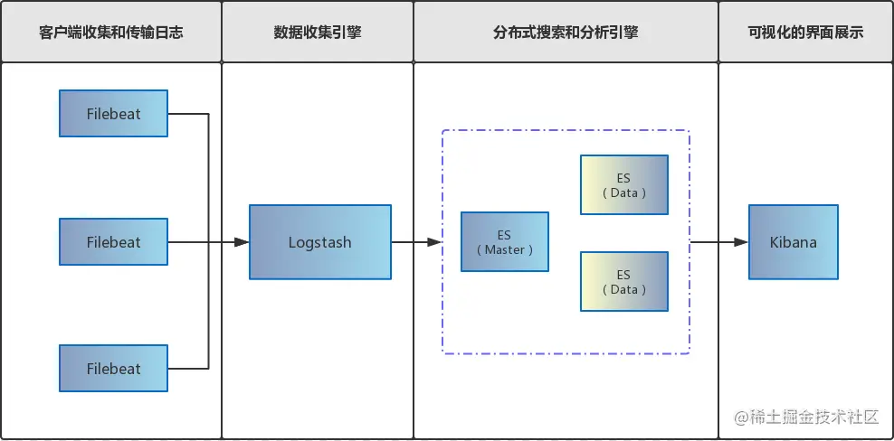
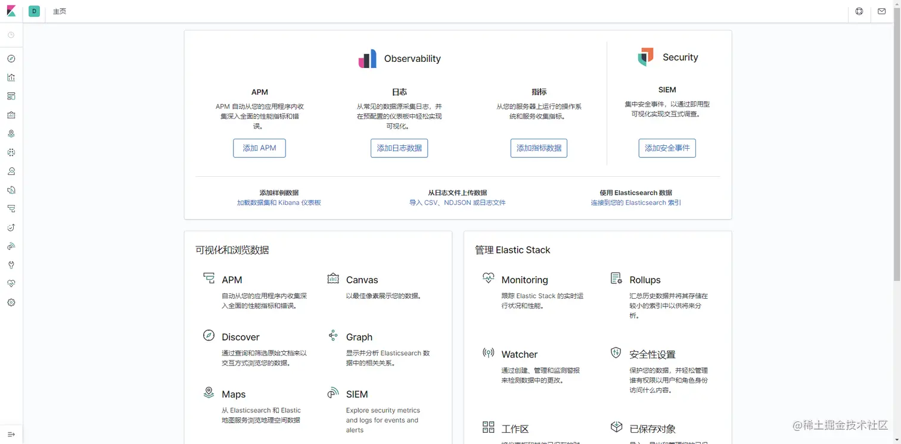
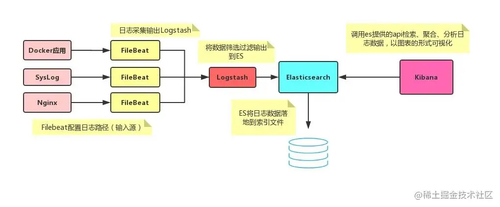

# Docker 部署 ELK 详解

## 什么是ELK

ELK 是 Elasticsearch、Logstrash 和 Kibana 的缩写，它们代表的是一套成熟的日志管理系统，ELK Stack 已经成为目前最流行的集中式日志解决管理方案。

### Elasticsearch

分布式搜索和分析引擎，具有高可伸缩、高可靠和易管理等特点。基于 Apache Lucene 构建，能对大容量的数据进行接近实时的存储、搜索和分析操作。通常被用作某些应用的基础搜索引擎，使其具有复杂的搜索功能；

### Logstash

数据收集引擎。它支持动态的从各种数据源搜集数据，并对数据进行过滤、分析、丰富、统一格式等操作，然后存储到用户指定的位置；

### Kibana

数据分析和可视化平台。通常与 Elasticsearch 配合使用，对其中数据进行搜索、分析和以统计图表的方式展示；

### Filebeat

ELK 协议栈的新成员，一个轻量级开源日志文件数据搜集器，基于 Logstash-Forwarder 源代码开发是对它的替代。在需要采集日志数据的服务上安装 Filebeat，并指定日志目录或日志文件后，Filebeat 就能读取日志文件数据，迅速发送到 Logstash 进行解析，或直接发送到 Elasticsearch 进行集中式存储和分析。

### 架构图

具体基于 Filebeat 的 ELK 分布式集中日志解决方案架构如图所示:



### 软件版本

ELK 的版本需要一致，不然可能导致 ELK 无法使用。`filebeat` 的版本不需要特别注意，无特殊需求与本文一致即可。

```shell
shell复制代码Kibana:7.1.1
Filebeat:7.0.1
Logstash:7.1.1
Elasticsearch:7.1.1
```

### 主机环境

`192.168.1.37` 服务器作为子服务器安装 `filebeat` ，`filebeat` 可以根据配置推送日志到已安装 ELK 的 `192.168.1.162` 主服务器 ，假设将来另一台服务器还想要部署需要记录日志的业务，只需要在新服务器上配置 `filebeat` 即可。

| IPAddress     | Mem  | 安装                                             |
| ------------- | ---- | ------------------------------------------------ |
| 192.168.1.162 | 5G   | elasticsearch、logstash、Kibana、filebeat、nginx |
| 192.168.1.37  | 1G   | filebeat                                         |

## Docker 安装与使用

请参考 [Docker入门与实践](https://link.juejin.cn/?target=http%3A%2F%2Fnote.youdao.com%2Fnoteshare%3Fid%3D2b8115d63a32baf54f5fc70b6c7cebd1%26sub%3D8FF2976F79874E078A174C4119418736)

### 核心配置文件

将ELK编写在同一 docker-compose 文件中方便启动时配置容器间通信：

#### docker-elk.yml

```yaml
version: "3"
services:
  es-master:
    container_name: es-master
    hostname: es-master
    image: elasticsearch:7.1.1
    restart: always
    user: root
    ports:
      - 9200:9200
      - 9300:9300
    volumes:
      - /www/elasticsearch/master/conf/es-master.yml:/usr/share/elasticsearch/config/elasticsearch.yml
      - /www/elasticsearch/master/data:/usr/share/elasticsearch/data
      - /www/elasticsearch/master/logs:/usr/share/elasticsearch/logs
    environment:
      - "ES_JAVA_OPTS=-Xms512m -Xmx512m"
      - "TZ=Asia/Shanghai"

  es-slave1:
    container_name: es-slave1
    image: elasticsearch:7.1.1
    restart: always
    ports:
      - 9201:9200
      - 9301:9300
    volumes:
      - /www/elasticsearch/slave1/conf/es-slave1.yml:/usr/share/elasticsearch/config/elasticsearch.yml
      - /www/elasticsearch/slave1/data:/usr/share/elasticsearch/data
      - /www/elasticsearch/slave1/logs:/usr/share/elasticsearch/logs
    environment:
      - "ES_JAVA_OPTS=-Xms512m -Xmx512m"
      - "TZ=Asia/Shanghai"

  kibana:
    container_name: kibana
    hostname: kibana
    image: kibana:7.1.1
    restart: always
    ports:
      - 5601:5601
    volumes:
      - /www/kibana/conf/kibana.yml:/usr/share/kibana/config/kibana.yml
    environment:
      - elasticsearch.hosts=http://es-master:9200
      - "TZ=Asia/Shanghai"
    depends_on:
      - es-master
      - es-slave1
  
  logstash:
    container_name: logstash
    hostname: logstash
    image: logstash:7.1.1
    command: logstash -f ./conf/logstash-filebeat.conf
    restart: always
    volumes:
      # 映射到容器中
      - /www/logstash/conf/logstash-filebeat.conf:/usr/share/logstash/conf/logstash-filebeat.conf
    environment:
      - elasticsearch.hosts=http://es-master:9200
      # 解决logstash监控连接报错
      - xpack.monitoring.elasticsearch.hosts=http://es-master:9200
      - "TZ=Asia/Shanghai"
    ports:
      - 5044:5044
    depends_on:
      - es-master
      - es-slave1
```

> 使用TZ=Asia/Shanghai避免docker时区非东八区问题导致@timestamp与上传时间对应不上的问题

#### es-master.yml

```yaml
yaml复制代码# 集群名称
cluster.name: es-cluster
# 节点名称
node.name: es-master
# 是否可以成为master节点
node.master: true
# 是否允许该节点存储数据,默认开启
node.data: true
# 网络绑定
network.host: 0.0.0.0
# 设置对外服务的http端口
http.port: 9200
# 设置节点间交互的tcp端口
transport.port: 9300
# 集群发现
discovery.seed_hosts:
  - es-master
  - es-slave1
  - es-slave2
# 手动指定可以成为 mater 的所有节点的 name 或者 ip，这些配置将会在第一次选举中进行计算
cluster.initial_master_nodes:
  - es-master
# 支持跨域访问
http.cors.enabled: true
http.cors.allow-origin: "*"
# 安全认证
xpack.security.enabled: false
#http.cors.allow-headers: "Authorization"
```

#### es-slave1.yml

```yaml
yaml复制代码# 集群名称
cluster.name: es-cluster
# 节点名称
node.name: es-slave1
# 是否可以成为master节点
node.master: true
# 是否允许该节点存储数据,默认开启
node.data: true
# 网络绑定
network.host: 0.0.0.0
# 设置对外服务的http端口
http.port: 9201
# 设置节点间交互的tcp端口
#transport.port: 9301
# 集群发现
discovery.seed_hosts:
  - es-master
  - es-slave1
  - es-slave2
# 手动指定可以成为 mater 的所有节点的 name 或者 ip，这些配置将会在第一次选举中进行计算
cluster.initial_master_nodes:
  - es-master
# 支持跨域访问
http.cors.enabled: true
http.cors.allow-origin: "*"
# 安全认证
xpack.security.enabled: false
#http.cors.allow-headers: "Authorization"
```

#### kibana.yml

```yaml
yaml复制代码# 服务端口
server.port: 5601
# 服务IP
server.host: "0.0.0.0"
# ES
elasticsearch.hosts: ["http://es-master:9200"]
# 汉化
i18n.locale: "zh-CN"
```

#### logstash-filebeat.conf

```shell
shell复制代码input {
  beats {
    port => 5044
  }
}
# 分析、过滤插件，可以多个
filter {
  grok {
    match => ["message", "%{TIMESTAMP_ISO8601:logdate}"]
  }
  date {
    match => ["logdate", "yyyy-MM-dd HH:mm:ss.SSS"]
    target => "@timestamp"
  }
}
output {
  elasticsearch {
    hosts => "http://es-master:9200"
    index => "%{[fields][log_topics]}-%{+YYYY.MM.dd}"
    document_type => "%{[@metadata][type]}"
  }
}
```

#### docker-filebeat.yml

filebeat单独部署在需要采集日志的服务器中

```yaml
yaml复制代码version: "3"
services:
  filebeat:
    # 容器名称
    container_name: filebeat
    # 主机名称
    hostname: filebeat
    # 镜像
    image: docker.elastic.co/beats/filebeat:7.0.1
    # 重启机制
    restart: always
    # 启动用户
    user: root
    # 持久化挂载
    volumes:
      # 映射到容器中[作为数据源]
      - /www/mua/runtime/log:/www/mua/runtime/log
      - /www/wx/runtime/log:/www/wx/runtime/log
      - /www/supplyChain/runtime/log:/www/supplyChain/runtime/log
      # 方便查看数据及日志(可不映射)
      - /opt/filebeat/logs:/usr/share/filebeat/logs
      - /opt/filebeat/data:/usr/share/filebeat/data
      # 映射配置文件到容器中
      - /opt/filebeat/conf/filebeat.yml:/usr/share/filebeat/filebeat.yml
    # 使用主机网络模式
    network_mode: host
```

#### filebeat.yml

```yaml
yaml复制代码filebeat.inputs:
- type: log
  enabled: true
  paths:
    - /www/mua/runtime/log/*[0-9][0-9].log
    - /www/mua/runtime/log/*_cli.log
  multiline:
    pattern: '[0-9]{4}-[0-9]{2}-[0-9]{2}T[0-9]{2}:[0-9]{2}:[0-9]{2}'
    negate:  true
    match:   after
  fields:
    log_topics: muats
- type: log
  enabled: true
  paths:
    - /www/mua/runtime/log/*_info.log
  multiline:
    pattern: '[0-9]{4}-[0-9]{2}-[0-9]{2}T[0-9]{2}:[0-9]{2}:[0-9]{2}'
    negate:  true
    match:   after
  fields:
    log_topics: muats-info
- type: log
  enabled: true
  paths:
    - /www/mua/runtime/log/*_error.log
  multiline:
    pattern: '[0-9]{4}-[0-9]{2}-[0-9]{2}T[0-9]{2}:[0-9]{2}:[0-9]{2}'
    negate:  true
    match:   after
  fields:
    log_topics: muats-error
output.logstash:
  hosts: ["115.236.191.59:5144"]
```

> 注意使用双空格代替tab缩进，缩进格式与示例一致。

## 部署服务

成功创建目录及配置文件后，即可进行ELK服务部署

```shell
shell
复制代码docker-compose -f docker-elk.yml up -d #安装服务
```

### 启动报错

max virtual memory areas vm.max_map_count [65530] is too low, increase to at least [262144]（elasticsearch 用户拥有的内存权限太小，至少需要262144） 解决办法：

```shell
shell复制代码# 修改配置sysctl.conf
[root@localhost ~]# vi /etc/sysctl.conf
# 添加下面配置：
vm.max_map_count=262144
# 重新加载：
[root@localhost ~]# sysctl -p
# 最后重新启动elasticsearch，即可启动成功。
```

移除ELK容器后重启可能会出现如下问题：service endpoint with name xxx already exists. 解决办法： 清理ELK容器的网络占用

```sh
sh
复制代码docker network disconnect --force bridge elk
```

单节点启动可能导致索引健康状态变为 yellow，原因为生成索引后默认的副本分片数量为1，但是实际只有一个生效的主分片

解决方法： 将索引副本分片的数量调整为0

```sh
sh复制代码curl --location --request PUT 'http://192.168.1.217:9200/_all/_settings' \
--header 'Content-Type: application/json' \
--data-raw '{"index.number_of_replicas": 0}'
```

优化解决方法：设置elasticsearch默认模板（之后创建索引副本为0）

```sh
sh复制代码curl -X PUT 192.168.1.217:9200/_template/log  -H 'Content-Type: application/json' -d '{
  "template": "*",
  "settings": {
    "number_of_shards": 1,
    "number_of_replicas": "0"
  }
}'

"template": "*" 代表所有 索引
"template": "apple*" 代表生成apple*的索引都会按照这个模板来了
```

### 访问 Kibana

访问如下端口验证 Kibana 运行情况：[http://IP:5601/](https://link.juejin.cn/?target=http%3A%2F%2FIP%3A5601%2F)



[Kibana 配置文件 kibana.yml 文件详解](https://link.juejin.cn/?target=https%3A%2F%2Fp1-jj.byteimg.com%2Ftos-cn-i-t2oaga2asx%2Fgold-user-assets%2F2020%2F1%2F16%2F16fad116570ab9b2~tplv-t2oaga2asx-image.image)

### 访问 Elasticsearch

访问如下端口验证 Elasticsearch 运行情况：[http://IP:9200/](https://link.juejin.cn/?target=http%3A%2F%2FIP%3A9200%2F)


至此环境搭建完成~

### Filebeat 收集日志



