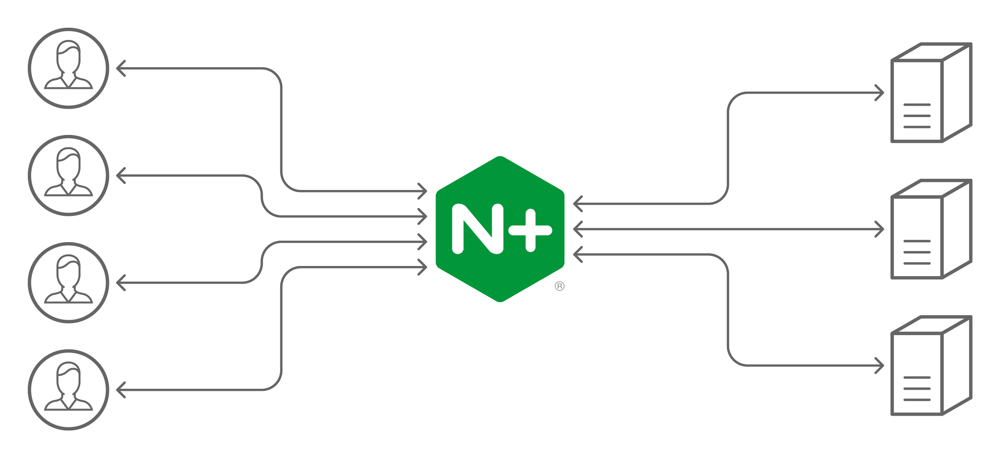
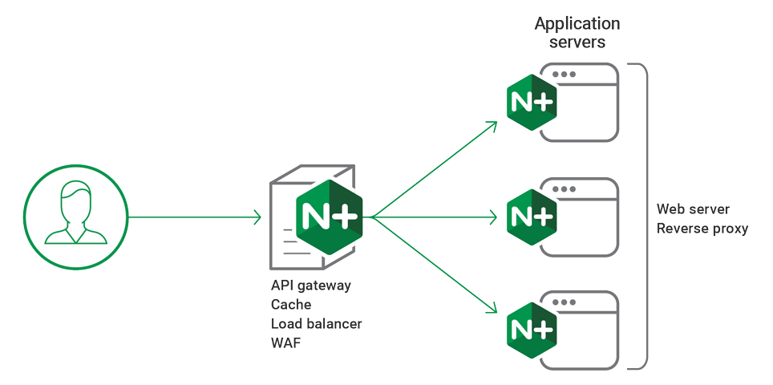
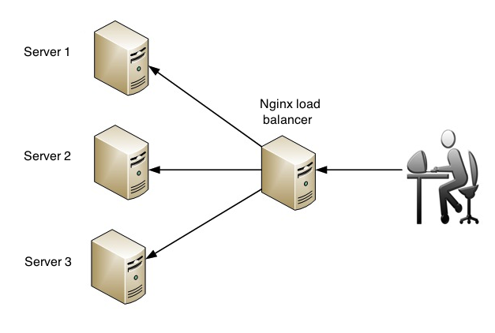
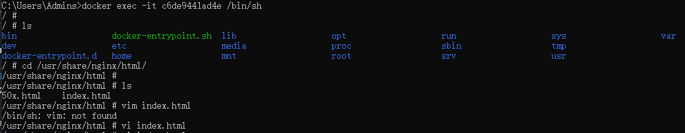
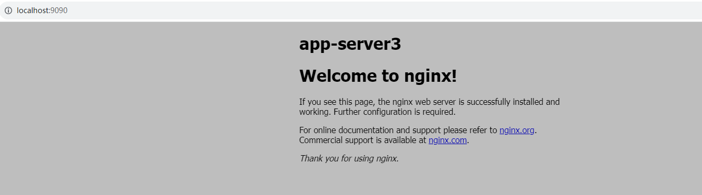

# 使用Docker+Nginx实现简易负载均衡

### Nginx负载均衡

`Nginx` 具有占有内存少，并发能力强等优点，非常适合用来做负载均衡服务，负载均衡*（`Load Balance`）*其意思就是将工作分摊到不同的服务器上，从而提高了系统的反应速度与总体性能等，解决互联网系统的高并发和高可用的问题。若系统只有一台服务器，当这台服务器宕机之后，或者是同时被非常多的用户访问，那将会出现用户无法访问或访问速度慢的问题，负载均衡能够有效避免这类问题的发生

### 简易负载均衡架构图

![基礎觀念系列] Web Server & Nginx — (2) | by 莫力全Kyle Mo | Starbugs Weekly 星巴哥技術專欄|  Medium](https://miro.medium.com/v2/resize:fit:1024/1*TrNJZqECEj0eVuJDeNKtNQ.png)

![基礎觀念系列] Web Server & Nginx — (2) | by 莫力全Kyle Mo | Starbugs Weekly 星巴哥技術專欄|  Medium](https://miro.medium.com/v2/resize:fit:1024/1*TrNJZqECEj0eVuJDeNKtNQ.png)







利用高性能Nginx来做反向代理，将http请求分发给多个App Server

### 配置并启动容器

准备4个Nginx容器，1个用来做负载均衡服务器，3个是App Server

`docker-compose.yml` 如下：

```yaml
version: '3'
services:
  nginx-load-balancing:
    image: nginx:alpine
    container_name: nginx-load-balancing
    ports:
      - "9090:80"
    volumes:
      - C:/data/loadbalance/nginx/nginx.conf:/etc/nginx/nginx.conf
    depends_on:
      - app-server1
      - app-server2
      - app-server3

  app-server1:
    image: nginx:alpine
    container_name: app-server1

  app-server2:
    image: nginx:alpine
    container_name: app-server2

  app-server3:
    image: nginx:alpine
    container_name: app-server3

networks:
  default:
    driver: bridge
```

负载均衡服务器配置 `nginx.conf` 如下：

```nginx
user  nginx;
worker_processes  auto;

error_log  /var/log/nginx/error.log warn;
pid        /var/run/nginx.pid;

events {
    worker_connections  10240;
}

http {
    include       /etc/nginx/mime.types;
    default_type  application/octet-stream;

    log_format  main  '$remote_addr - $remote_user [$time_local] "$request" '
                      '$status $body_bytes_sent "$http_referer" '
                      '"$http_user_agent" "$http_x_forwarded_for"';

    access_log  /var/log/nginx/access.log  main;

    sendfile        on;
    #tcp_nopush     on;

    keepalive_timeout  65;

    #gzip  on;

    upstream backend-server {
        server app-server1:80;
        server app-server2:80;
        server app-server3:80;
    }
    
    server {
        server_name localhost;
        listen 80 ;
        access_log /var/log/nginx/access.log;
        location / {
            proxy_pass http://backend-server;
        }
    }
    
}
```

由于4个容器都在同一docker网络中，因此在配置 `upstream` 模块时，可以直接使用容器名称

使用 `docker-compose up -d` 启动应用

### 测试

分别进入容器 `app-server1` ， `app-server2` ，`app-server3` ，在 `/usr/share/nginx/html/index.html` 中标注当前的容器名称，使用浏览器访问 `http://localhost:9090` 

```shell
# 注意/bin/bash修改为/bin/sh
docker exec -it 7cdf63bbf6bb /bin/sh
```






### 负载均衡upstream分配方式

`Nginx` 的 `upstream` 模块主要支持以下五种分配方式：

- 轮询
  这是默认的分配方式，根据请求的时间顺序均匀的分配到每个服务器

  ```nginx
  upstream backend-server {
      server app-server1:80;
      server app-server2:80;
      server app-server3:80;
  }
  ```

- weight
  这是轮询的加强版，没有设置取默认值1，负载均衡服务器会以 1:2:3 的比例将请求转发到3台服务器，主要用于服务器配置差异的场景

  ```nginx
  upstream backend-server {
      server app-server1:80;
      server app-server2:80 weight=2;
      server app-server3:80 weight=3;
  }
  ```

- ip_hash
  根据每个请求IP地址的Hash结果进行分配，使得每个访客会固定访问同一台服务器

  ```nginx
  upstream backend-server {
      ip_hash;
      server app-server1:80;
      server app-server2:80;
      server app-server3:80;
  }
  ```

- fair
  根据后端服务器响应时间来分配，响应时间越短越优先

  ```nginx
  upstream backend-server {
      server app-server1:80;
      server app-server2:80;
      server app-server3:80;
      fair;
  }
  ```

- url_hash
  根据访问url的hash结果来分配请求，使得每个url会固定访问同一台服务器，使用了hash算法则server中不能再使用weight等参数

  ```nginx
  upstream backend-server {
      server app-server1:80;
      server app-server2:80;
      server app-server3:80;
      hash $request_uri;    hash_method crc32;
  }
  ```