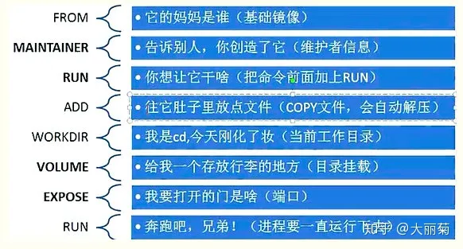

刚开始接触docker时大家基本都是通过`docker pull`命令来拉取镜像，在此基础上`docker exec/run`这些命令，进入容器做一些配置上的修改以此来构建一个容器，而Dockerfile就是一个一劳永益的构建镜像的方法，通过编写Dockerfile来定制自己的镜像。

说白了，就是类似于Python项目的requirements.txt文件，你可以在里面写上自己需要的依赖包，然后安装构建自己项目的依赖:

> requirements.txt => Dockerfile
> pip install => docker build

这篇博客会以构建一个简单的Postgres镜像为例，讲一讲用Dockerfile来定制自己的镜像的过程。****


## 定制一个Postgres镜像

## 一些基本概念

**如果你已经了解过Dockerfile的语法，可以直接跳过这一节**

网上找了张图，可以参考一下:




Dockerfile是有它的基本语法的，它由一行行命令语句组成，其中注释以#开头，并且，一个完整的Dockerfile一般包含下面这几部分：

1. 基础镜像 由`FROM 基础镜像`这个命令来使用，标志着我们定制的镜像是以哪个镜像作为基础进行制作的。 举个栗子: `FROM postgres:latest`
2. 维护者信息 这里要写上Dockerfile编写者的信息，一般写上自己的邮箱或者nickname就可以，用法是**LABEL** maintainer=**"个人信息"**。 栗子: **LABEL LABEL** maintainer=**"mambahj24@gmail.com"**
3. 镜像的操作命令 当我们需要定制一个镜像的时候，肯定是要运行一些命令（安装一些依赖，修改一些配置等等）来对基础镜像做一些修改的，一般使用`RUN 具体命令`来操作，RUN的默认权限是sudo。 需要注意的是，如果你需要执行多个RUN操作，那最好把它们合并在一行 (**用&&连接**)，因为每执行一次RUN就会在docker上新建一层镜像，所以分开来写很多个RUN的结果就是会导致整个镜像无意义的过大膨胀。 正确的做法: `bash RUN apt-get update && apt-get install vim`

不提倡的做法： `bash RUN apt-get update RUN apy-get install vim`

1. 容器启动时执行的命令 需要用CMD来执行一些容器启动时的命令，注意与RUN的区别，CMD是在`docker run`执行的时候使用，而RUN则是在`docker build`的时候使用，还有，**划重点**，一个Dockerfile只有最后一个CMD会起作用。 栗子： `bash CMD ["/usr/bin/wc","--help"]`

除了以上这4个部分，ENV（设置环境变量）、EXPOSE（暴露容器内部端口）也很常用，用法分别是：

```text
ENV <KEY> <VALUE>

EXPOSE 端口号
```