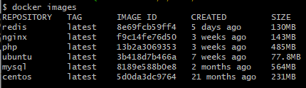

maple639555@gmail.com

docker安装redis

### 1、查看可用的 Redis 版本

```shell
docker search redis
```

### 2、取最新版的 Redis 镜像

这里我们拉取官方的最新版本的镜像：

```shell
docker pull redis:latest
```

### 3、查看本地镜像

使用以下命令来查看是否已安装了 redis：

```
$ docker images
```



### 4、运行容器

安装完成后，我们可以使用以下命令来运行 redis 容器：

1. 创建容器

```shell
$ docker run -itd --name redis-test -p 26379:6379 redis
```

参数说明：

- **-p 6379:6379**：映射容器服务的 6379 端口到宿主机的 6379 端口。外部可以直接通过宿主机ip:6379 访问到 Redis 的服务。

冒号前是外部访问端口，冒号后面是内部服务端口

2. 解读参数

-d: 后台运行容器，并返回容器ID；

-i: 以交互模式运行容器，通常与 -t 同时使用；

-p: 端口映射，格式为：主机(宿主)端口:容器端口

-t: 为容器重新分配一个伪输入终端，通常与 -i 同时使用；

--ip: 为容器制定一个固定的ip

--net: 指定网络模式

测试

申请证书

1. 生成自签名证书和私钥 您需要生成一个自签名证书和私钥，以便在Redis和客户端之间建立加密连接。您可以使用openssl命令生成这些文件。以下是生成证书和私钥的示例命令：

```shell
openssl req -newkey rsa:2048 -nodes -keyout redis.key -x509 -days 365 -out redis.crt
```

1. 将证书和私钥文件复制到Docker容器中 您需要将上一步生成的证书和私钥文件复制到Redis Docker容器中。可以使用docker cp命令将这些文件从本地文件系统复制到容器内。

```
$ docker cp redis.crt redis:/usr/local/etc/redis/
$ docker cp redis.key redis:/usr/local/etc/redis/
```

