# 拉取Nginx镜像

首先可以通过 `docker search nginx` 查看Nginx的镜像列表

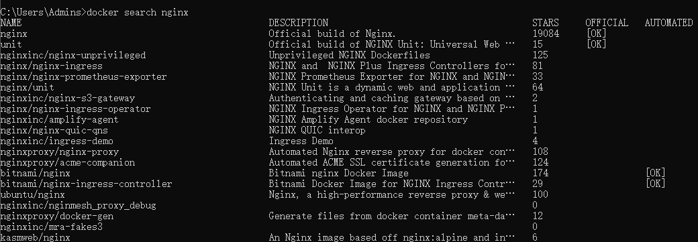

然后使用 `docker pull nginx` 获取Nginx 镜像，这种方式是获取Nginx最新版本，如果需要获取其他版本，可以通过[dockerhub](https://link.juejin.cn?target=https%3A%2F%2Fhub.docker.com%2F_%2Fnginx%3Ftab%3Ddescription)查询

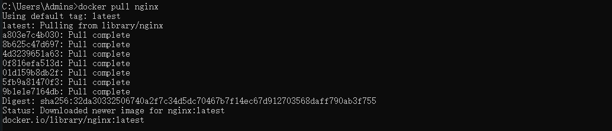

此刻，Nginx算是已经安装好了，是不是很简单。

可以通过 `docker images` 查看安装的镜像列表，或者通过 `docker images nginx` 查看Nginx的信息。

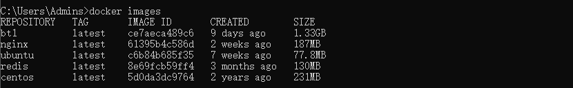

上图中的 `IMAGE ID` 是一个重要的信息，这个是全局唯一的，由于位数太多，我们可以通过使用前几位来代表Nginx这个镜像。比如 “0466”，下面我们会使用到。

# 创建容器

在前面我们已经把Nginx安装好了，现在我们需要启动Nginx。

```
docker run --name nginx-test -p 80:80 -d nginx
```

命令解释

- **docker run ：** 是创建一个新容器并运行一个命令
- **--name ：** 给容器起一个名字，指的是 nginx-test
- **-p  ：**   指定宿主机与容器内部端口的映射关系，-p [宿主机端口]:[容器内部端口]，我设置的是 80：80
- **-d ：**    设置容器在在后台一直运行
- 最后面的 nginx 是镜像名称，也可以是镜像ID，例如上面提到的 “0466”

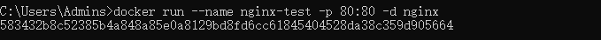

启动Nginx后，返回的名称为`nginx-test`的容器唯一ID。

可以通过 `docker ps` 查看Docker 创建的容器

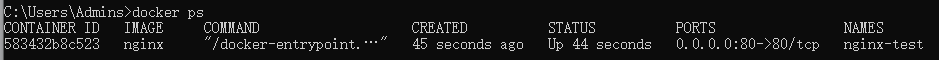

此刻就可以通过`ip+端口`的方式访问Nginx，不过我使用的是80端口，可以不加端口号。访问的是Nginx的默认网页。

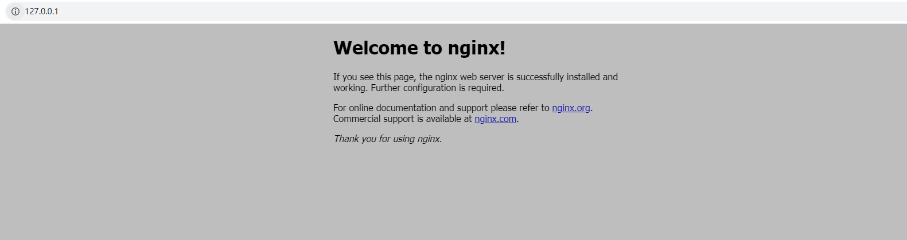

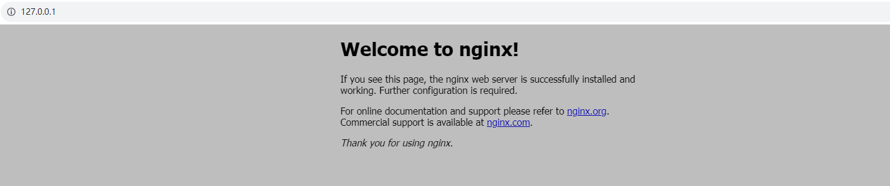


> 需要注意的是，如果使用的是云服务器，需要在安全组的规则中，打开上面设置的端口号，不然是访问不了的。

# 更改Nginx容器内配置文件

由于我们使用的Docker安装的Nginx环境，所以Nginx的所有文件都在Docker容器中，要想修改的话，也需要进入容器中修改。

使用 `docker exec -it 6139 /bin/bash` 命令进入名称为nginx-test的容器中

命令解释

- **docker exec ：** 在运行的容器中执行命令。
- **-it ：** -i和-t两个参数配合使用，开启一个交互模式的终端。
- **e37 ：** 名称为nginx-test容器ID。
- **/bin/bash ：** 指定了执行命令的shell。

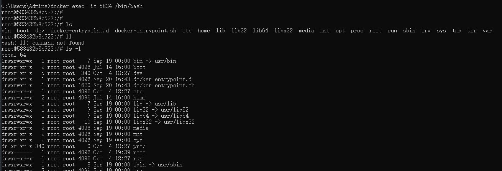

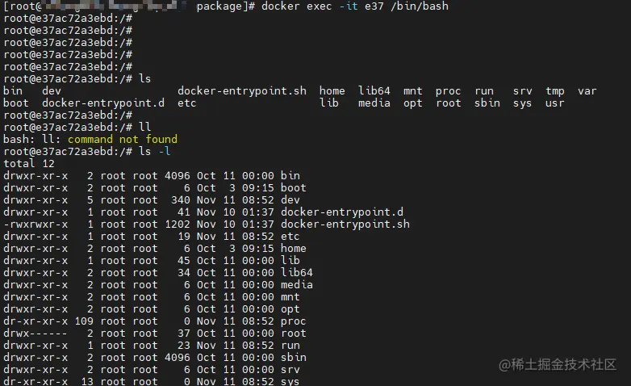

容器内部也是一个Linux环境。

通过 `cd /etc/nginx` 进入Nginx配置文件目录

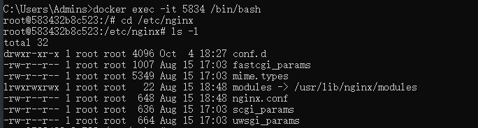

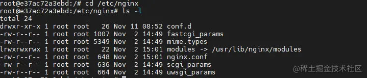

nginx容器内的默认首页html文件目录为 `/usr/share/nginx/html`，日志文件位于 `/var/log/nginx`

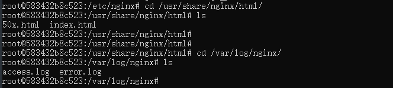

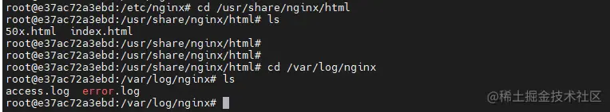

知道了Nginx容器内的配置文件路径，就可以直接在容器内更改了。

但是每次更改都必须进入容器才可以，如果修改频繁的话，就会比较麻烦，所以还有另外一种方法，那就是通过将容器内的文件挂载到宿主机上，以后每次修改就可以通过修改宿主机上的Nginx配置文件，映射容器内的文件。

# 通过挂载文件方式更改配置文件

1. 在宿主机中找一个合适的目录新建 nginx目录， `mkdir nginx`, 在nginx 目录下新建 conf、logs、html目录。

将容器内的`nginx.conf`与`default.conf`文件分别拷贝到主机`~/nginx`与目录`~/nginx/conf`下

```shell
docker cp 583432b8c523:/etc/nginx/nginx.conf C:\work\www\nginx

docker cp 583432b8c523:/etc/nginx/conf.d/default.conf C:\work\www\nginx/conf/
```

`e37` 为容器ID，可以通过 `docker ps` 查看创建的容器

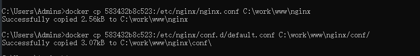

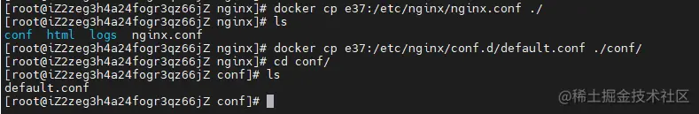

1. 接下来我们需要重新创建一个nginx容器，同时带上挂载的文件。首先需要把原来的容器停止，并且删除掉。

```
docker stop 583
docker rm 5834
```

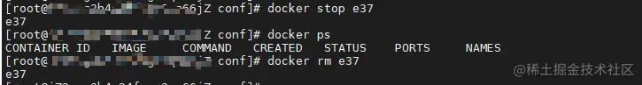

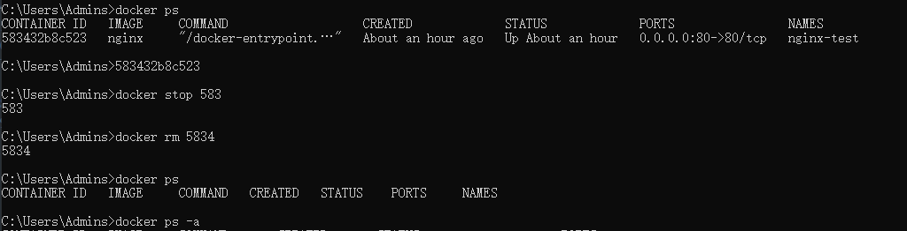

1. 重新创建nginx容器

```linux
docker run --name nginx-config -p 80:80 -v C:\work\www\nginx/nginx.conf:/etc/nginx/nginx.conf  -v C:\work\www\nginx/logs:/var/log/nginx  -v C:\work\www\nginx/html:/usr/share/nginx/html  -v C:\work\www\nginx/conf:/etc/nginx/conf.d  --privileged=true -d nginx
```

- **-v:** 挂载目录。
- **--privileged=true ：** 让容器拥有权限。

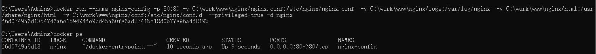

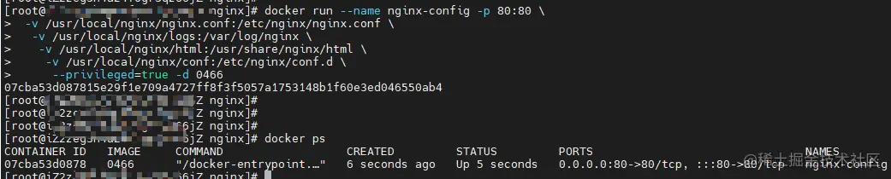

可以考到新的容器已经重新启动。

由于容器内只挂载了Nginx的默认页面的目录，所以需要在 `/usr/local/nginx/html` 目录下新建一个页面，Nginx就可以重新访问了。

# 遇到的一些问题

- 修改宿主机上的文件，不生效怎么办？

一般吧容器重启下就可以了。

- 通过挂载文件新建容器时，容器名称重复怎么办？

通过 `docker ps -a` 查看所有容器，然后把被占用的容器删除 `docker rm 容器名称`。

- 通过挂载文件新建容器时后，访问Nginx，显示403 Forbidden，怎么办？

默认页如果没有的话，那就新建一个文件；如果有的话，看看是否不能匹配虚拟主机中的规则，因为只是用IP访问的话，可能找不到，需要把文件名称加到IP后面，例如 IP/文件名称。

以上就是我部署Nginx的过程。