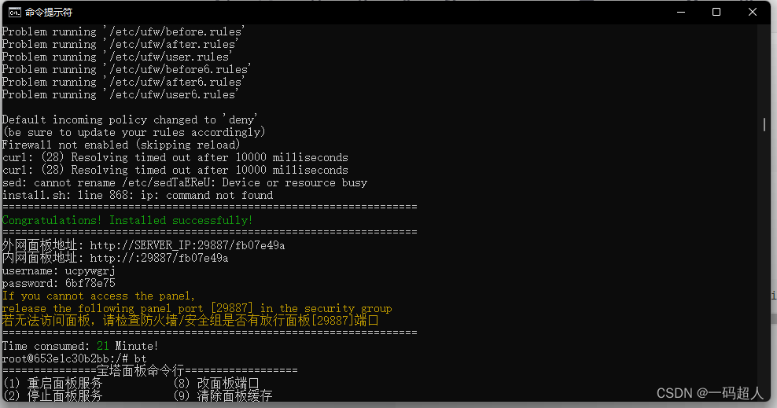
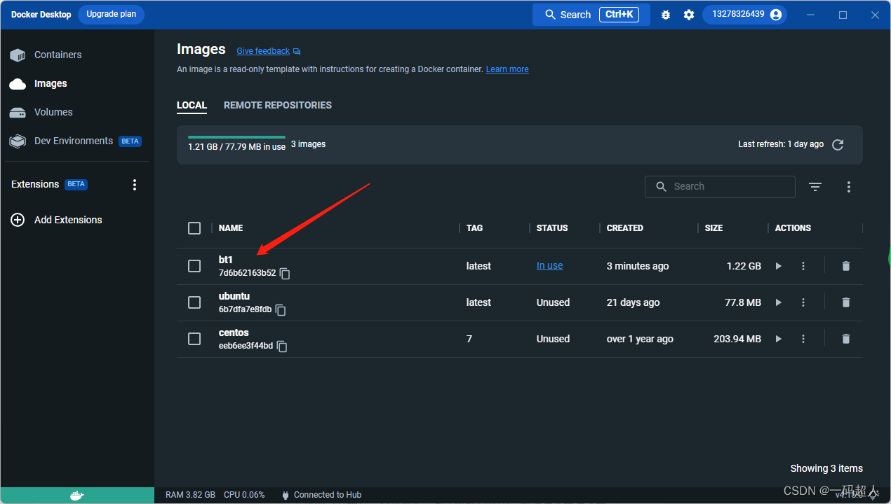
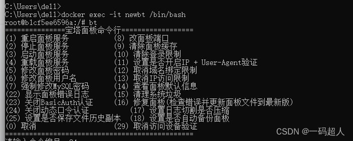
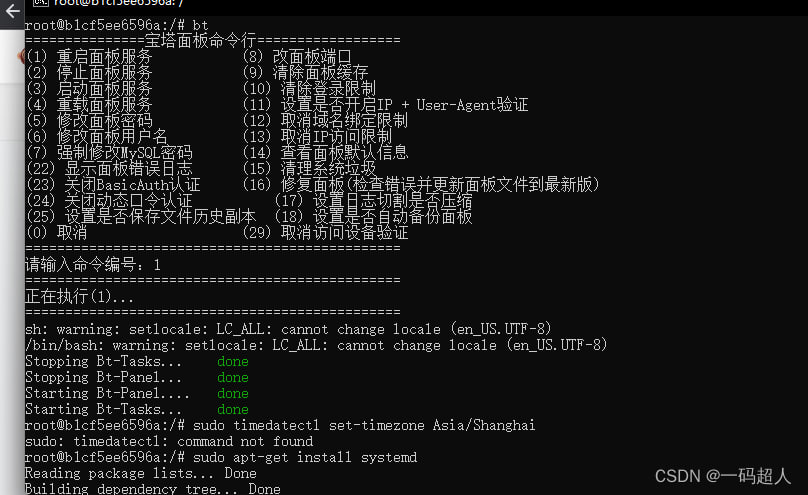
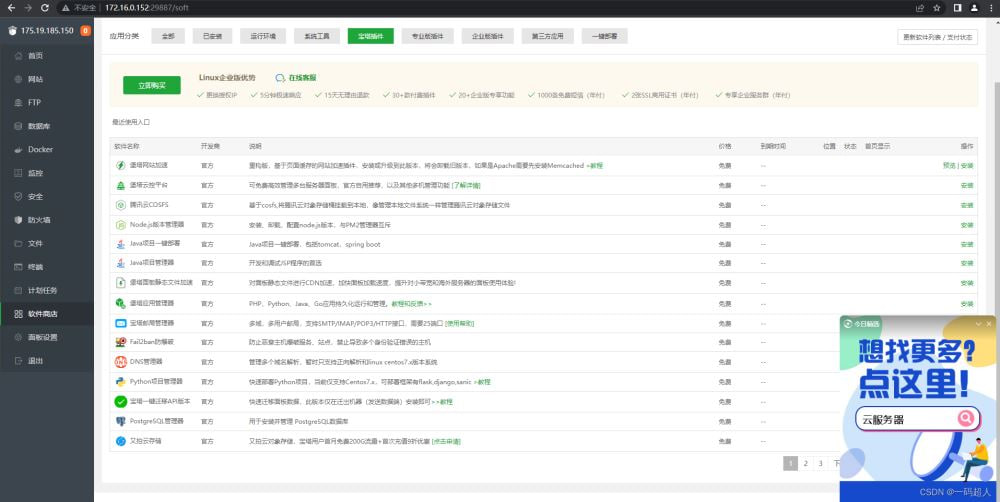
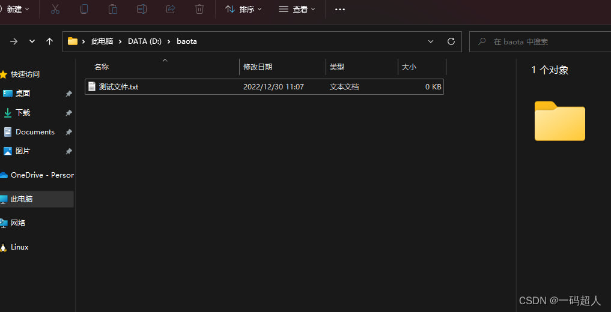
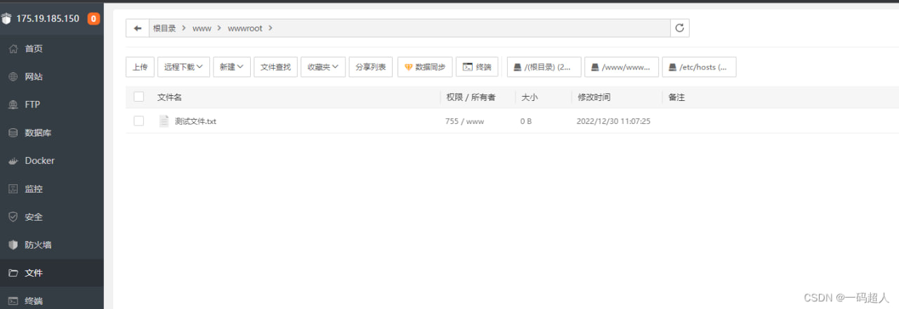

# Docker中安装宝塔的详细教程

这篇文章主要介绍了Docker中安装宝塔的详细教程，本文给大家介绍的非常详细，对大家的学习或工作具有一定的参考借鉴价值,需要的朋友可以参考下

## 1、docker拉取ubuntu系统

```shell
docker pull ubuntu
```

## 2、运行容器

```shell
docker run -i -t -d --name bt -p 2000:20 -p 2100:21 -p 8000:80 -p 4430:443 -p 8880:888 -p 8888:8888 --privileged=true -v /d/baota:/www/wwwroot ubuntu
```

-v后的/d/baota代表本地D盘的baota目录与ubuntu系统中得到/www/wwwroot映射

## 3、进入容器

```shell
docker exec -it bt /bin/bash
```

## 4、安装sudo、wget

```shell
//更新apt-get
apt-get update
//安装sudo
apt-get -y install sudo
//安装wget
apt-get -y install wget
```

## 5、安装宝塔

官网：宝塔面板下载，免费全能的服务器运维软件

```shell
wget -O install.sh https://download.bt.cn/install/install-ubuntu_6.0.sh && sudo bash install.sh ed8484bec
```

流程就略过了，直到显示如下内容：



**注意：该端口是安装宝塔后随机生成的端口，比较坑，容器并没有开通这个端口，所以需要如下步骤。**

## 6、打包容器为镜像

bt是容器名，bt1是打包后的镜像名

```shell
docker commit bt bt1
```



## 7、运行生成的镜像，重新配置端口

```shell
docker run -i -t -d --name newbt -p 2000:20 -p 2100:21 -p 8000:80 -p 4430:443 -p 8880:888 -p 8888:8888 -p 29887:29887 --privileged=true -v /d/baota:/www/wwwroot bt1
```

## 8、进入容器

```shell
docker exec -it newbt /bin/bash
```

 注意：你会发现容器运行以后依然无法通过浏览器访问，是因为宝塔没有启动，进入容器输入如下命令。

```shell
bt
```



输入1回车，重启面板。



 这时你就可以通过本地访问容器中的宝塔了



 因为本地D://baota映射了容器中宝塔的/www/wwwroot目录，方便项目部署及同步。





##  9、部署你的多个项目

这步就是正常操作宝塔了，注意端口，如果没有就自行打包容器为镜像，然后重新设置端口运行。

## 10、将最终的容器打包为最终的项目镜像。

这步就自行发挥了！

打包镜像：

```shell
docker commit newbt mybt
```

运行镜像：

```shell
docker run -i -t -d --name newbt -p 2000:20 -p 2100:21 -p 8000:80 -p 4430:443 -p 8880:888 -p 8888:8888 -p 29887:29887 --privileged=true -v /d/baota:/www/wwwroot mybt
```

到此这篇关于Docker中安装宝塔的文章就介绍到这。