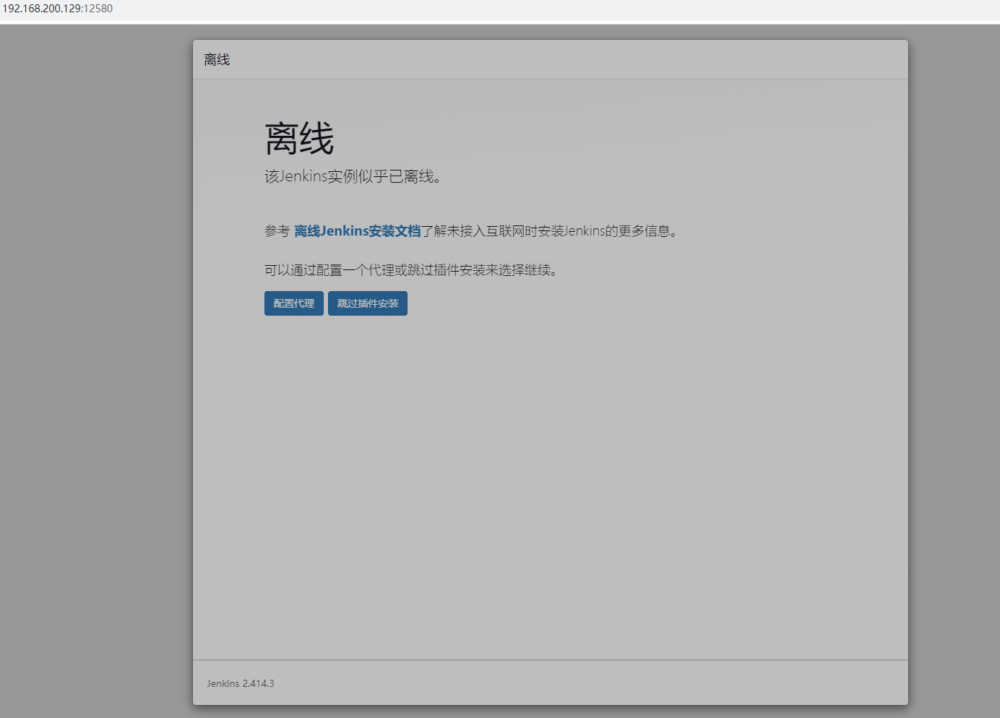

## docker部署安装jenkins

## Jenkins 简介

### Jenkins 是什么

Jenkins 是一款开源 CI&CD 软件，用于自动化各种任务，包括构建、测试和部署软件。

Jenkins 支持各种运行方式，可通过系统包、Docker 或者通过一个独立的 Java 程序。

### CI/CD 是什么

CI(Continuous integration，中文意思是持续集成)是一种软件开发时间。持续集成强调开发人员提交了新代码之后，立刻进行构建、（单元）测试。根据测试结果，我们可以确定新代码和原有代码能否正确地集成在一起。借用网络图片对 CI 加以理解。


CD(Continuous Delivery， 中文意思持续交付)是在持续集成的基础上，将集成后的代码部署到更贴近真实运行环境(类生产环境)中。比如，我们完成单元测试后，可以把代码部署到连接数据库的 Staging 环境中更多的测试。如果代码没有问题，可以继续手动部署到生产环境。下图反应的是 CI/CD 的大概工作模式。


## Jenkins 安装

首先，我们需要一台安装了docker的服务器。（这个我已经在我的小主机上安装了）

**第一步，把镜像给拉下来**

```shell
docker pull jenkins/jenkins:lts
```


**第二步，创建映射目录**

```shell
# 在适当的位置创建映射目录
mkdir -p jenkins_home
# 查看目录权限
ls -nd jenkins_home
# 改变拥有者为管理员
sudo chown -R 1000:1000 jenkins_home
```


**第三步，启动jenkins**

```shell
# 查看docker的镜像
docker images
```


```shell
# 启动Jenkins
docker run -d -p 12580:8080 --name=jenkins -v /my_data/jenkins_home/:/var/jenkins_home jenkins/jenkins:lts
```

**第四步，打开jenkins的网页**


然后我们需要进入到容器里，查看这个密码

```shell
# 查看容器列表
docker ps
```


然后根据container ID进入容器

```shell
sudo docker exec -it 6064 /bin/sh
```

然后获取密码

```shell
cat /var/jenkins_home/secrets/initialAdminPassword
```

由于我们将`/var/jenkins_home` -- 挂载到--> `/home/jenkins_home`所以也可以直接`cat /home/jenkins_home/secrets/initialAdminPassword` 获取密码。


接着把这个密码填进去上面的网页中即可。

然后可能报错：该Jenkins实例似乎已离线。



解决方法：

1.保留此离线页面，重新开启一个浏览器tab标签页

2.输入输入网址 http://localhost:8080/pluginManager/advanced

3.进入该页面最底下，找到【升级站点】，把其中的链接改成http，http://updates.jenkins.io/update-center.json ，确定保存


4.提示jenkins，在重新启动jenkins，OK，已经可以重新连网，下载插件

```shell
# 重启docker服务后再启动容器
systemctl restart docker
docker start jenkins
```


接下来，**安装推荐的插件**


然后创建管理员用户这些操作，Jenkins就安装完成了！


### 配置jenkins

#### 全局工具配置

  主要配置 jdk、maven、git等常用环境。需要注意配置的别名，后续构建将会使用到。

##### 配置jdk

  因为jenkins镜像自带jdk所以无需安装直接使用即可，进入Jenkins容器，使用`java -verbose`查看java安装路径。

```shell
docker exec -it jenkins /bin/bash
java -verbose
```


##### 配置git

 进入容器内使用`whereis git`即可查询到git安装路径。

```text
jenkins@606434c6a8de:/$ whereis git
git: /usr/bin/git /usr/share/man/man1/git.1.gz
```


##### 配置maven

 maven直接使用自动安装即可。


