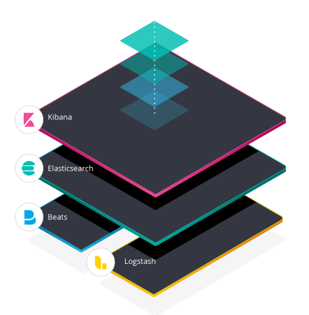
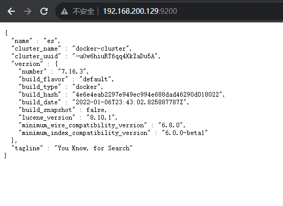
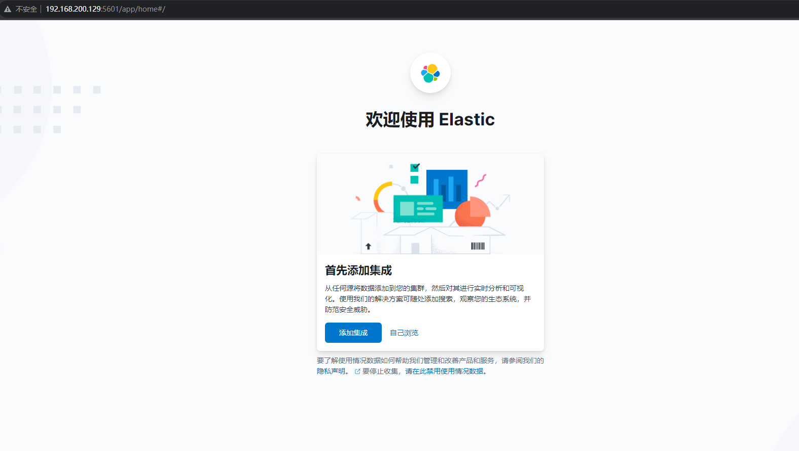
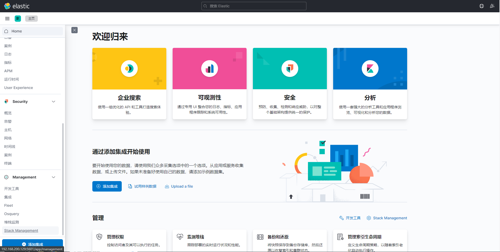
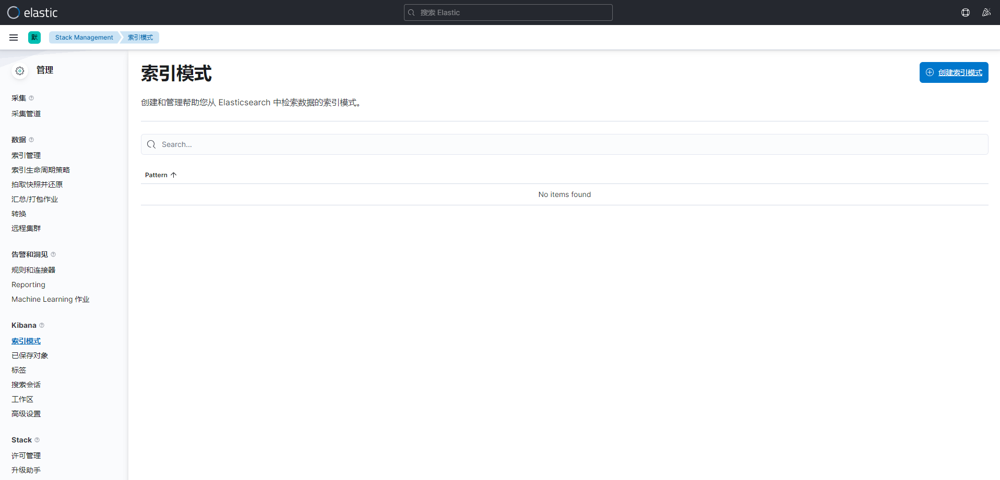

# 单机 Docker 部署 ELK（ElasticSearch、Kibana、Logstash）




# Docker 部署 ELK（ElasticSearch、Kibana、Logstash）

## 什么是ELK？

ELK是一个日志收集、切割、过滤、储存、展示的大型服务。它包含以下服务：

- ElasticSearch：分布式搜索引擎，这里充当日志储存的服务。
- Kibana：简单来说就是将es中的数据可视化。
- Logstash：日志收集服务，他可以收集多个来源的日志，比如文件、mq、redis等等

在ELK中三个服务版本更迭到8之后，ELK更名为ELK Stack（Elastic Stack）。https://www.elastic.co/cn/what-is/elk-stack

因为Logstash功能很多，占用系统资源过高，而有时我们只需要读取日志文件即可，所以将之前版本的Logstash中的file beats插件单独提取出来，也就是Beats。这样可以减少Logstash的部署实例，减轻服务压力。同时beats既可以输出到Logstash进一步处理，也可以直接输出到ES中储存。

[](https://dxytoll-img-1304942391.cos.ap-nanjing.myqcloud.com/img/blog/elk-stack-elkb-diagram.svg)

## 部署

注意：

- ELK三个服务需要使用相同版本，如果版本有差异会出现不可预估的错误
- 部署服务器配置有限制，我这里使用的 4 core+4 g 的配置，并且这里将es中JVM限制，如果配置不够请勿部署，防止服务器宕机丢失数据。

拉取三者镜像，这里我们使用7.16.3版本

```shell
docker pull elasticsearch:7.16.3
docker pull kibana:7.16.3
docker pull elasticsearch:7.16.3
```

### 1. 搭建网桥

这里我们创建名为ELK网桥，方便之后ELK中服务解析ip

```shell
docker network create --driver=bridge ELK
```

### 2. ElasticSearch

```shell
docker run -d --name es \
  -p 9200:9200 \
  -p 9300:9300 \
  -e ES_JAVA_OPTS="-Xms256m -Xmx256m" \
  -e "discovery.type=single-node" \
  --network ELK -h "es" \
  elasticsearch:7.16.3
```

- -p：端口映射：9200为es访问端口，9300为集群部署交互端口
- ES_JAVA_OPTS：es中jvm配置，这里限制为“-Xms256m -Xmx256m”，防止es占用过多崩溃
- discovery.type=single-node：单点部署
- –network ELK -h “es”：加入网桥ELK，ip映射为“es”

部署完可以访问9200端口，如果出现以下内容即为部署成功

[](https://dxytoll-img-1304942391.cos.ap-nanjing.myqcloud.com/img/blog/image-1655397470893.png)

### 2. Kibana

注意：需要在es部署之后部署，如果先部署可能出现未知错误

```shell
docker run  -d \
  -e ELASTICSEARCH_HOSTS=http://es:9200 \
  -p 5601:5601  \
  -e I18N_LOCALE=zh-CN \
  --name kibana \
  --network ELK -h "kibana" \
  kibana:7.16.3
```

- ELASTICSEARCH_HOSTS：es地址
- -p：5601位kibana默认访问端口
- I18N_LOCALE：设置kibana为中文
- –network ELK -h “kibana”： 加入网桥ELK，ip映射为“kibana”

访问5601端口：

[](https://dxytoll-img-1304942391.cos.ap-nanjing.myqcloud.com/img/blog/image-1655398170534.png)

### 3. Logstash

这里需要将相关日志文件映射到宿主机上，再将文件映射到Logstash内

如果有错误请查看日志！！！！

```shell
docker run -d -u root \
  -v /data/ELK/logstash/logstash.yml:/usr/share/logstash/config/logstash.yml \
  -v /data/ELK/logstash/pipelines.yml:/usr/share/logstash/config/pipelines.yml \
  -v /data/ELK/logstash/pipe/:/usr/share/logstash/pipeline/ \
  -v /data/ELK/testlogs/:/var/logs/ \
  --name logstash \
  --network=ELK \
  logstash:7.16.3
```

logstash.yml：logstash配置文件

```yaml
#节点名称，在集群中具备唯一性，默认为logstash主机的主机名
node.name: logstast
 
#输入、输出及过滤器的总工作数量，也就是logstash的工作进程，此工作进程默认为主机的cpu核心数量
pipeline.workers: 1 
 
#在输入阶段，单个工作线程将从输入中收集的最大事件数，此事件数堆内存开销较大，内存开销可在jvm.options中设置堆内存大小来优化此选项
pipeline.batch.size: 30
 
#在将一个较小的批发送到filters+output之前,轮询下一个事件时等待的时间(以毫秒为单位)
pipeline.batch.delay: 50
 
#设置为true时，在强制关闭logstash期间，即使内存中还有事件，那么为true将会强制关闭，导致数据丢失；默认为false，false在强制关闭logstash期间，将拒绝退出，直到所有在管道中的事件被安全输出，再关闭。
pipeline.unsafe_shutdown: false
 
#logstash间隔多久检查一次配置中的更改，默认为3秒
config.reload.interval: 15s
```

pipelines.yml：Logstash管道配置文件

```yaml
#唯一id(标识用的)
- pipeline.id: http.conf
  #开启线程数量
  pipeline.workers: 1
  #指定对应conf文件
  path.config: "/usr/share/logstash/pipeline/http.conf"
 
- pipeline.id: rpc.conf
  #开启线程数量
  pipeline.workers: 1
  #指定对应conf文件
  path.config: "/usr/share/logstash/pipeline/rpc.conf"
  
- pipeline.id: nginx.conf
  #开启线程数量
  pipeline.workers: 1
  #指定对应conf文件
  path.config: "/usr/share/logstash/pipeline/nginx.conf"
 
- pipeline.id: vue.conf
  #开启线程数量
  pipeline.workers: 1
  #指定对应conf文件
  path.config: "/usr/share/logstash/pipeline/vue.conf"
```

/usr/share/logstash/pipeline/：这里映射了管道的具体配置文件，与pipelines.yml中设置有关，以nginx.conf为例

```text
input{
    file{
        path => "/var/logs/nginx/logs/access.log"
        start_position => "beginning"
    }
}
filter {
    json{
        source => "message"
        target => "doc"
    }
    date {
      match => ["timestamp", "ISO8601"]
    }
 
}
output {
    elasticsearch {
        hosts => ["es:9200"]
        index => "nginx-access-log"
    }
}
```

- input：数据来源，这里选择文件
- filter：过滤器，用于处理日志，这里使用json filter处理
- output：输出，这里选择es

## 查看日志

### Kibana添加解析

在kibana设置中选择 Stack Management

[](https://dxytoll-img-1304942391.cos.ap-nanjing.myqcloud.com/img/blog/image-1655399341796.png)

左侧选择“索引模式”，右侧选择创建索引模式

[](https://dxytoll-img-1304942391.cos.ap-nanjing.myqcloud.com/img/blog/image-1655399429733.png)

选择对应索引，然后创建

[](https://dxytoll-img-1304942391.cos.ap-nanjing.myqcloud.com/img/blog/image-1655399506293.png)

点击左侧Discover

[](https://dxytoll-img-1304942391.cos.ap-nanjing.myqcloud.com/img/blog/image-1655399568935.png)

[](https://dxytoll-img-1304942391.cos.ap-nanjing.myqcloud.com/img/blog/image-1655399807106.png)












