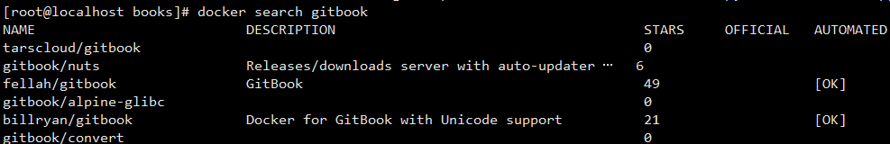
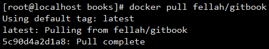
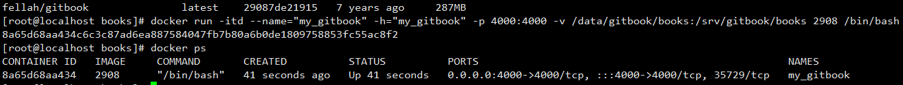
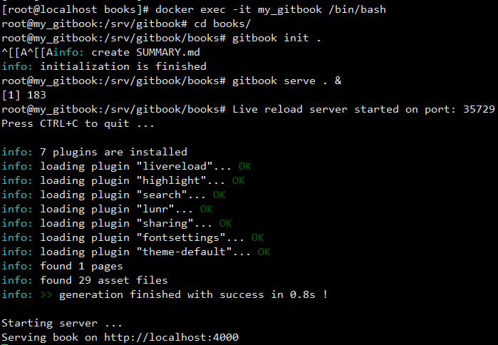
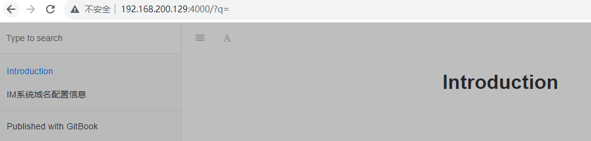

## Gitbook快速搭建

### 1.1. 系统环境

做一件事要有个开始点，正确开始点对完成这件事很总要；很多时候在学习一个新的技能时，这个开始点很难选择。本项目的开始点就是**找到一个CentOS7系统**。为什么选择这个作为开始点呢？因为它能够更快速的构建这个项目，至于具体为什么，下面的内容会慢慢体现出来。

本项目选择的是腾讯云的CVM系统，你也可以选择其他平台，或者自己的笔记本；当然，自己配置一个系统可能会有很多麻烦事，这个自己安装就会知道了。在安装操作系统时，选择公共镜像CentOS7就可以了。

### 1.2. Docker环境

上面选择CentOS7的一个好处就是能够很好的支持Docker运行环境，至于为什么选择Docker，就是应为简单、快速。在Docker Hub中有别人搭建好的Gitbook镜像，拉取下来就可以使用了。因此，这一步就是**安装Docker环境**。

第一步要先安装Docker软件。需要提醒的是你的CentOS7需要联网，而且有一个好的yum源。这也是CVM的便捷之处。

```
yum install docker -y
```

第二步是要**启动docker和配置开机启动docker**.处理命令来启动之外，还可以使用/etc/init.d/rc.local等开机启动脚本来配置

```
systemctl start docker.service
systemctl enable docker.service
```

如果使用的CentOS7以前的版本，可以使用service启动docker

```
service docker start
chconfig --add docker
```

### 1.3. GitBook容器

启动好了Docker服务之后，我们就可以拉取Gitbook镜像了。先**查找合适的镜像**。不过由于Docker Hub的服务器在USA，国内又有网络出口限制，因此下载速度可能会很忙，请耐心等待，或者使用国内HUB。

```shell
docker search gitbook
```



选好需要镜像后，我们需要**将镜像拉取到本地**

```shell
docker pull docker.io/fellah/gitbook
```



基于该镜像**创建一个容器**

```shell
docker run -itd --name="my_gitbook" -h="my_gitbook" -p 4000:4000 -v /data/gitbook/books:/srv/gitbook/books 2908 /bin/bash
```

在创建容器时考虑到可以使用gitbook提供web服务，可以用在搭建web服务器了就将4000端口映射到容器内gitbook的默认端口4000，当然你也可以搭建一个web服务器。 还有就是希望这个容器只是提供gitbook服务，至于md文档我放置在CentOS7的/data/gitbook/books目录就可以，后期的管理更加方便。



### 1.4. Gitbook服务

容器创建好了，接下来就是进入容器内部使用gitbook了

```shell
docker exec -it my_gitbook /bin/bash
```

前面讲项目目录文件/data/gitbook/books映射到容器的/srv/gitbook/books目录了，现在进入该目录**初始化gitbook项目并启动预览服务**即可

```shell
cd /srv/gitbook/books
gitbook init .
# gitbook build . 
gitbook serve . &
# gitbook serve --lrport 35730 --port 4001
```



### 1.5. 预览

如果上面的一切都OK的话，你就可以通过浏览器访问你的gitbook项目了。



### 1.6.GitBook 服务多开

gitbook启动的web 服务默认监听4000端口，而重启监控进程默认监听35729端口。

一般这样可以启动一个电子书web服务:

```shell
gitbook serve /somepath/your_docuemtn_dir/
```

本地就可以这样来访问:  [http://localhost:4000](https://cloud.tencent.com/developer/tools/blog-entry?target=https%3A%2F%2Flinks.jianshu.com%2Fgo%3Fto%3Dhttp%3A%2F%2Flocalhost%3A4000)

如果要启动另一部电子书服务的话， 就需要同时修改web端口和监控进程端口， 类似这样:

```shell
gitbook serve --lrport 35288 --port 4001 /path2/your_another_doc_dir/
```

##### 指定端口号再启动

```shell
gitbook serve --lrport 35730 --port 4001
```

### 1.6. 后记

上面使用了一个简单的方法搭建了gitbook服务，其实一开始我并没有这样想，开始我是想先安装nodejs，然后安装npm，然后安装cnpm，然后安装gitbook，然后....但是在安装gitbook的时候卡主了，官方给的npm安装gitbook在Linux和Windows上不能正确安装的，就是因为依赖MacOS上的fsevent模块。这个是错误不是告警，因此不能成功安装，这个应该是npm官方的npm依赖配置有问题，具体没有深究。

还有就是上面的搭建好了之后还有很多可以优化的地方，比如：

- 1.给CVM的IP地址申请一个域名解析到该IP
- 2.在这个CentOS7上搭建一个git Server，以后push md文件就使用git方式
- 3.gitbook serve本身的并发不高，后续可以搭建一个nginx Web服务器代理。


