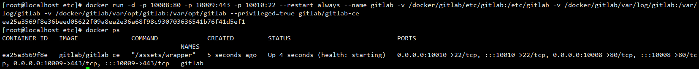
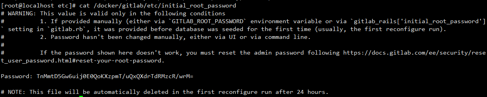

# 使用docker快速部署gitlab

## 一、说明

- 现在公司内所有项目都使用gitlab
- gitlab的升级越来越频繁了
- gitlab的功能越来越丰富了
- 日常我们需要做升级或者测试gitlab功能，可随时使用docker搭建一个gitlab服务器，避免操作生产环境

## 二、环境

- 操作系统：windows 11
- docker 版本：20.10.24
- gitlab版本：15.11（2023/5/9最新版）

## 三、部署

### 1、创建目录

```shell
# 在自己的任何一个盘，用powershell创建3个空白目录
mkdir -p /docker/gitlab/etc
mkdir -p /docker/gitlab/log
mkdir -p /docker/gitlab/data
```

### 2、拉取镜像

```plain
# 拉取最新版gitlab
docker pull gitlab/gitlab-ce
```

### 3、通过docker运行gitlab

```shell
# 可选参数1 
docker run -d -p 10008:80 -p 10009:443 -p 10010:22 --restart always --name gitlab -v /docker/gitlab/etc/gitlab:/etc/gitlab -v /docker/gitlab/var/log/gitlab:/var/log/gitlab -v /docker/gitlab/var/opt/gitlab:/var/opt/gitlab --privileged=true gitlab/gitlab-ce
```

```shell
# 可选参数2
docker run -detach --hostname localhost -p 7002:80 -p 7001:443 -p 7003:22 --name gitlab --restart unless-stopped -v /docker/gitlab/etc:/etc/gitlab -v /docker/gitlab/log:/var/log/gitlab -v /docker/gitlab/data:/var/data/gitlab gitlab/gitlab-ce:latest
```

**命令参数解释：**

- -detach：让启动的容器在后台运行
- --hostname：主机名
- -p：将容器端口映射到容器外部，其中前面是外部端口，后面是容器端口
- --name：容器名称
- --restart：指定容器重启的策略，有三种模式，这里配置的是 unless-stopped ，意思就是容器退出时总是重启
- -v：将容器内路径映射到容器外，其中前面是外部路径，后面是容器中路径
- gitlab/gitlab-ce:latest：使用的镜像

### 4、查看容器运行状态

```shell
docker ps
```



## 四、访问gitlab

### 1、查看gitlab密码

- gitlab默认管理员账号是root
- gitlab默认密码是放置在 /etc/gitlab/initial_root_password 中的，可进入终端查看后复制即可登陆，注意，这个密码有效期只有24小时，所以第一次登录一定要更改root密码



### 2、访问gitlab


此时，我们就可以正常使用gitlab了！