# JumpServer docker搭建及使用

## 一、前言

今天介绍一款备受欢迎的开源堡垒机或者说跳板机，在日常服务器运维中会经常用到，后端或者运维小伙伴可能比较熟悉，是一款日常使用率较高的软件。

> 官网：www.jumpserver.org/
>
> GitHub地址：github.com/jumpserver/jumpserver

## 二、跳板机、堡垒机是什么

### 跳板机

跳板机是一台机器！

**跳板机**：也叫前置机，是一台可以访问的服务器，再通过这台服务器去访问别的机器。跳板机可以是Linux系统，也可以是Windows系统。

跳板机示意图


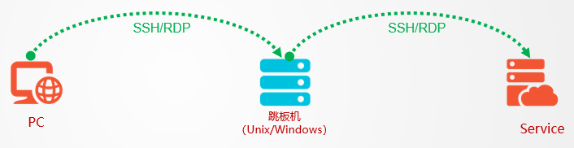

用到跳板机的场景通常是由于网络原因，服务器无法连接，所以提供一台可以连接的服务器，而这台服务器可以连接服务器，这样，这台服务器就承担了一个跳板的角色。

### 堡垒机

堡垒机不仅仅是一台机器！

运维堡垒主机是种具备强大防御功能和安全审计功能的服务器。基于跳板机理念，作为内外网络的个安全审计监测点，以达到把所有网站安全问题集中到某台服务器上解决，从而省时省力。同时运维堡垒主机还具备了，对运维人员的远程登录进行集中管理的功能作用。

堡垒机示意图

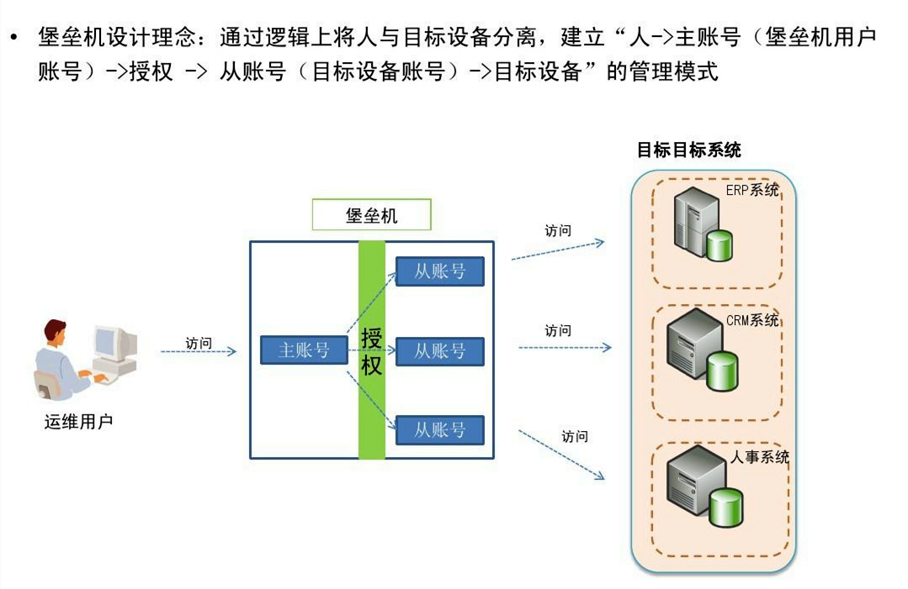

**堡垒机**：也叫做运维安全审计系统，它的核心功能是 4A：

- 身份验证 Authentication
- 账号管理 Account
- 授权控制 Authorization
- 安全审计 Audit

简单来说，堡垒机是用来控制哪些人可以登录哪些资源，以及录像记录登录资源后做了什么事情。

## 三、JumpServer介绍

`JumpServer `堡垒机帮助企业以更安全的方式管控和登录各种类型的资产。

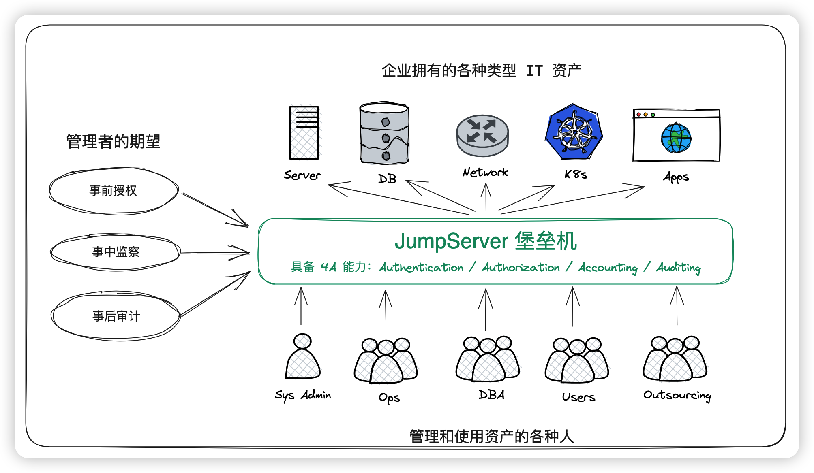

### 功能

JumpServer 是广受欢迎的开源堡垒机，是符合 4A 规范的专业运维安全审计系统。

JumpServer 堡垒机帮助企业以更安全的方式管控和登录各种类型的资产，包括：

- **SSH**: Linux / Unix / 网络设备 等；
- **Windows**: Web 方式连接 / 原生 RDP 连接；
- **数据库**: MySQL / MariaDB / PostgreSQL / Oracle / SQLServer / ClickHouse 等；
- **NoSQL**: Redis / MongoDB 等；
- **GPT**: ChatGPT 等;
- **云服务**: Kubernetes / VMware vSphere 等;
- **Web 站点**: 各类系统的 Web 管理后台；
- **应用**: 通过 Remote App 连接各类应用。

当然，我接触`JumpServer`还是因为它可以管理众多的服务器（不管是阿里云、腾讯云的ECS还是本地虚拟化的KVM虚拟机），能够使得公司内部能有效协作、规范管理，能够有效管理服务器资源，尤其是在业务、人员权限变动比较大的团体效果尤为明显。

### 优势

JumpServer 堡垒机支持事前授权、事中监察、事后审计，满足等保合规要求，符合 4A 规范的堡垒机：

- 身份验证 / Authentication：防止身份冒用和复用
- 授权控制 / Authorization：防止内部误操作和权限滥用
- 账号管理 / Accounting：人员和资产的管理
- 安全审计 / Auditing：追溯的保障和事故分析的依据

尤其是随着等保、密评等政府信息化项目的要求，堡垒机的需求也日渐凸显，除了企业自身需求，也会有一些项目等保密评要求使用堡垒机。

## 四、安装

### 环境介绍

| 操作系统   | 配置  | ip地址          | 主机名     | 安装软件 |
| ---------- | ----- | --------------- | ---------- | -------- |
| centos 7.6 | 2核4g | 192.168.200.134 | jumpserver | docker   |
| centos 7.6 | 1核2g | 192.168.200.135 | node-1     | 无       |
| centos 7.6 | 1核2g | 192.168.200.136 | node-2     | 无       |

### mysql

使用[docker](https://link.juejin.cn/?target=https%3A%2F%2Fso.csdn.net%2Fso%2Fsearch%3Fq%3Ddocker%26spm%3D1001.2101.3001.7020)方式安装

注意：密码不要设置123456这种简单的密码

```shell
mkdir -p /data/mysql/data

docker run -d --name mysql --restart=always -e MYSQL_ROOT_PASSWORD=admin@666  -p 3306:3306 -v /data/mysql/data:/var/lib/mysql mysql:5.7 --character-set-server=utf8mb4 --collation-server=utf8mb4_unicode_ci
```

创建jumpserver数据库

注意：密码不要设置123456这种简单的密码，否则会导致jumpserver无法写入数据！提示无法连接mysql

```shell
# docker exec -it mysql /bin/bash

# mysql -u root -padmin@666
mysql> create database jumpserver default charset 'utf8mb4';
mysql> grant all on jumpserver.* to 'jumpserver'@'%' identified by 'admin@666';
mysql> flush privileges;
mysql> exit;
# exit
```

### redis

使用docker方式安装

```shell
mkdir -p /data/redis/data

docker run -d -it --name redis -p 6379:6379 -v /data/redis/data:/data --restart=always  --sysctl net.core.somaxconn=1024  redis:latest --requirepass "123456"
```

### jumpserver

Jumpserver 封装了一个 All in one Docker, 可以快速启动。该镜像集成了所需要的组件, 支持使用外置 Database 和 Redis

### 生成随机加密密钥

```shell
if [ "$SECRET_KEY" = "" ]; then SECRET_KEY=`cat /dev/urandom | tr -dc A-Za-z0-9 | head -c 50`; echo "SECRET_KEY=$SECRET_KEY" >> ~/.bashrc; echo $SECRET_KEY; else echo $SECRET_KEY; fi
 
if [ "$BOOTSTRAP_TOKEN" = "" ]; then BOOTSTRAP_TOKEN=`cat /dev/urandom | tr -dc A-Za-z0-9 | head -c 16`; echo "BOOTSTRAP_TOKEN=$BOOTSTRAP_TOKEN" >> ~/.bashrc; echo $BOOTSTRAP_TOKEN; else echo $BOOTSTRAP_TOKEN; fi
```

### 启动jumpserver

这里使用最新版本

```shell
mkdir -p /data/jumpserver

docker run -d --name jumpserver -h jumpserver --restart=always  \
    -v /data/jumpserver:/opt/jumpserver/data/media \
    -p 80:80 \
    -p 2222:2222 \
    -e SECRET_KEY=$SECRET_KEY \
    -e BOOTSTRAP_TOKEN=$BOOTSTRAP_TOKEN \
    -e DB_HOST=192.168.200.134 \
    -e DB_PORT=3306 \
    -e DB_USER=jumpserver \
    -e DB_PASSWORD="admin@666" \
    -e DB_NAME=jumpserver \
    -e REDIS_HOST=192.168.200.134 \
    -e REDIS_PORT=6379 \
    -e REDIS_PASSWORD="123456" \
jumpserver/jms_all:latest
```

参数解释：

-h 指定docker主机名

-e 指定环境变量，注意修改mysql和redis的ip地址和密码。

```shell
# 查看jumpserver启动日志
docker logs -f jumpserver 
# 进入容器命令
docker exec -it jumpserver /bin/bash
```

### 访问网页

[http://192.168.200.134/](https://link.juejin.cn/?target=http%3A%2F%2F192.168.31.200%2F)

用户名：admin 密码：admin

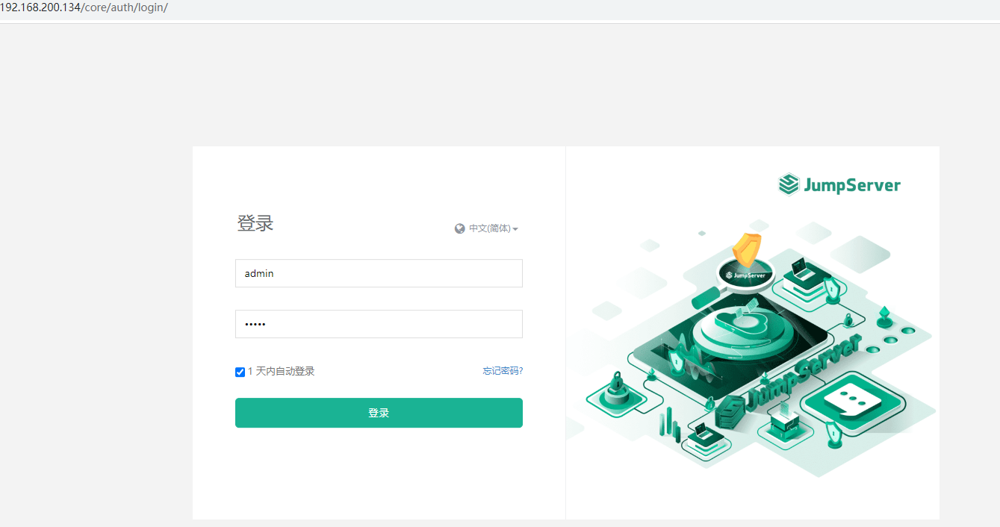

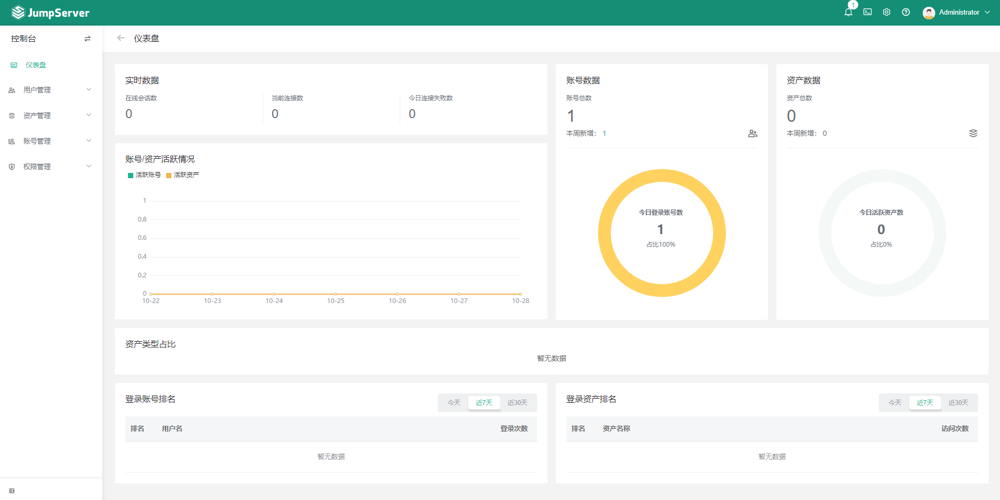

## 五、 页面展示

控制台

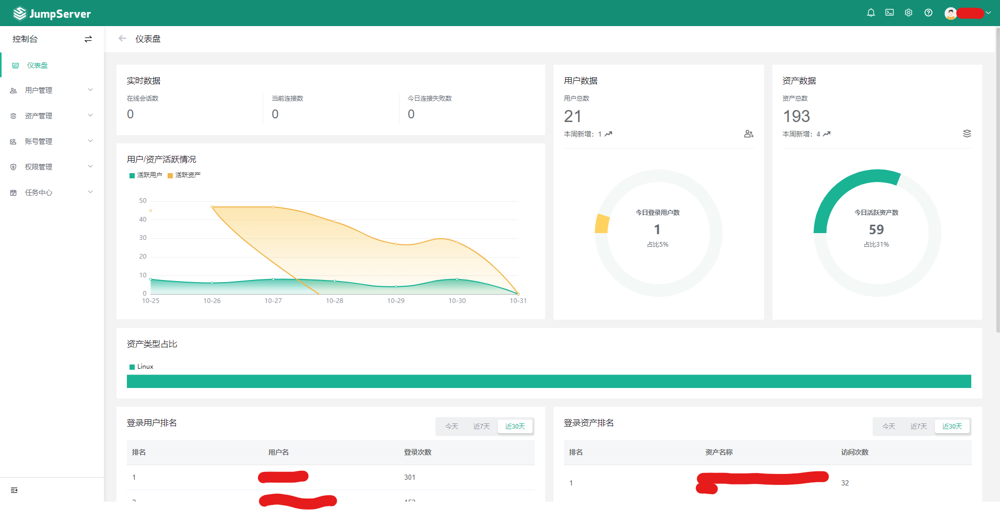

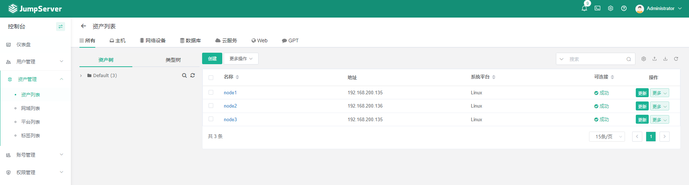

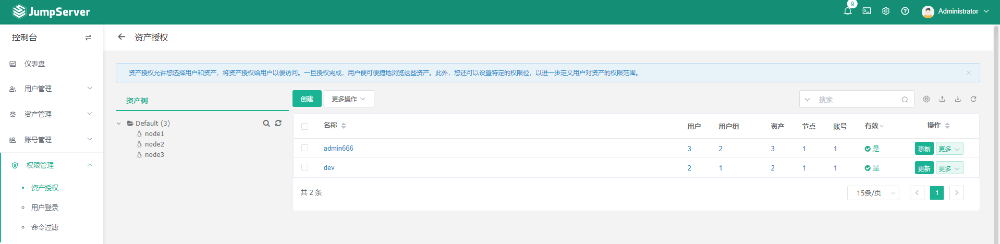

工作台

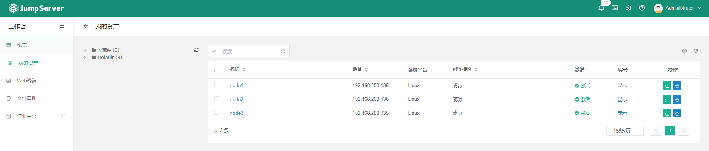

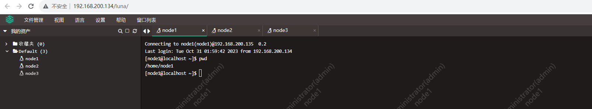

审计台

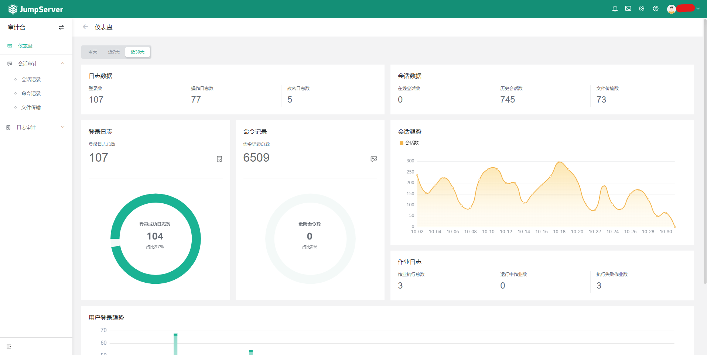

### 总结

个人使用经验，`JumpServer`很适合有内部服务器或者云服务器众多，后端、运维较多，有一定管理需求的企业，能够通过`JumpServer`将服务器有效的管理起来，同时能够避免因为密码泄露造成分风险


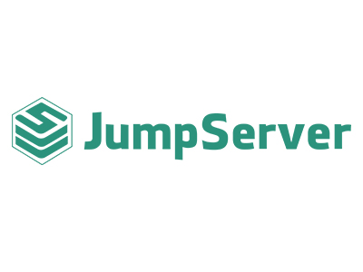

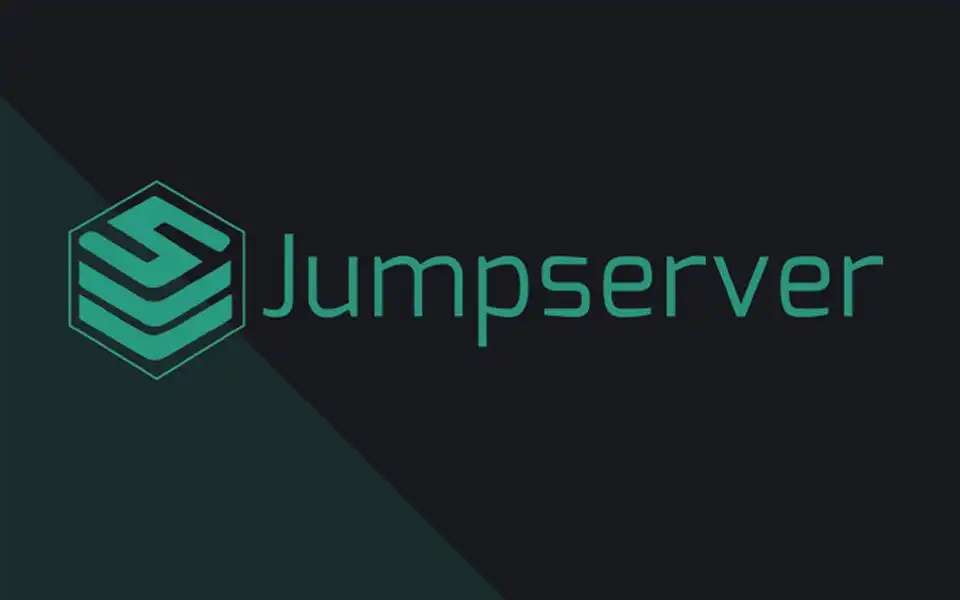

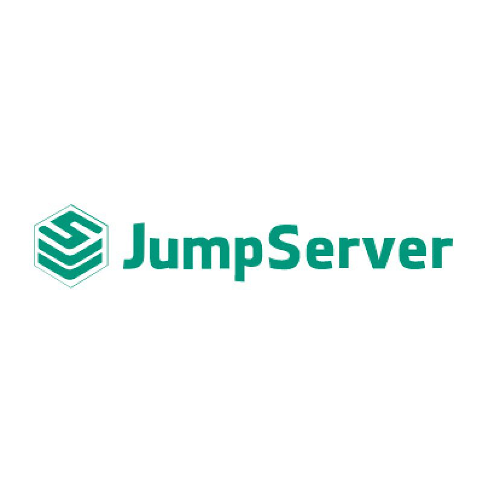
