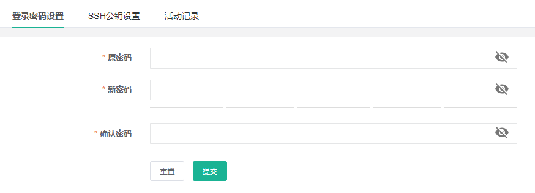

# Jumpserver docker搭建及使用

## 前言

大家好，本人[TopJohn](https://link.juejin.cn?target=https%3A%2F%2Fop-lab.top)，互联网码农，开源爱好者。

今天主要介绍下一款备受欢迎的开源堡垒机或者说跳板机，在日常服务器运维中会经常用到，后端或者运维小伙伴可能比较熟悉，是一款日常使用率较高的软件。

> 官网：[www.jumpserver.org/](https://link.juejin.cn?target=https%3A%2F%2Fwww.jumpserver.org%2F)
>
> GitHub地址：[github.com/jumpserver/…](https://link.juejin.cn?target=https%3A%2F%2Fgithub.com%2Fjumpserver%2Fjumpserver)

## 介绍

`JumpServer `堡垒机帮助企业以更安全的方式管控和登录各种类型的资产。


### 功能

主要包括以下6大功能：

- SSH：Linux / Unix / 网络设备 等
- Windows：Web 方式连接 / 原生 RDP 连接
- 数据库：MySQL / Oracle / SQLServer / PostgreSQL 等
- Kubernetes：支持连接到 K8s 集群中的 Pods
- Web站点：各类系统的 Web 管理后台
- 应用：通过 Remote App 连接各类应用

当然，我接触`JumpServer`还是因为它可以管理众多的服务器（不管是阿里云、腾讯云的ECS还是本地虚拟化的KVM虚拟机），能够使得公司内部能有效协作、规范管理，能够有效管理服务器资源，尤其是在业务、人员权限变动比较大的团体效果尤为明显。

### 优势

按官方的说法是：

> 九年时间，倾情投入，用心做好一款堡垒机。
>
> “ JumpServer 从创立至今始终坚持开源开放，始终坚持倾听社区心声，始终坚持高质量快速迭代。我们将继续秉承这些原则，用心做好一款堡垒机。”—— JumpServer 开源项目创始人 广宏伟

确实，`JumpServer`这款堡垒机在开源领域目前还没有对手，一般的互联网金融科技企业管理服务器资产应该都会选择`JumpServer`：

- 开源：零门槛，线上快速获取和安装
- 无插件：仅需浏览器，极致 Web Terminal 使用体验
- 分布式：轻松支持大规模并发访问
- 多云支持：一套系统，同时管理不同云上资产
- 云端存储：审计录像存放在云端，永不丢失
- 多租户：一套系统，多个子公司和部门同时使用

JumpServer 堡垒机支持事前授权、事中监察、事后审计，满足等保合规要求，符合 4A 规范的堡垒机：

- 身份验证 / Authentication：防止身份冒用和复用
- 授权控制 / Authorization：防止内部误操作和权限滥用
- 账号管理 / Accounting：人员和资产的管理
- 安全审计 / Auditing：追溯的保障和事故分析的依据

尤其是随着等保、密评等政府信息化项目的要求，堡垒机的需求也日渐凸显，除了企业自身需求，也会有一些项目等保密评要求使用堡垒机。

## 架构

JumpServer 采用分层架构，分别是负载层、接入层、核心层、数据层、存储层，下图为官方给出的应用架构图：


- Core 组件是 JumpServer 的核心组件，其他组件依赖此组件启动。
- Koko 是服务于类 Unix 资产平台的组件，通过 SSH、Telnet 协议提供字符型连接。
- Lion 是服务于 Windows 资产平台的组件，用于 Web 端访问 Windows 资产。
- Omnidb 是服务于数据库的组件，用于可视化界面纳管数据库。
- Razor 是服务于 RDP 协议组件，该组件主要功能是通过 JumpServer Client 方式访问 Windows 资产。
- Magnus 是服务于数据库的组件，用于通过客户端代理访问数据库。
- Celery 是处理异步任务的组件，用于执行 JumpServer 相关的自动化任务。

JumpServer 分为多个组件，大致的架构如下图所示，其中 [Lina](https://link.juejin.cn?target=https%3A%2F%2Fgithub.com%2Fjumpserver%2Flina%2F) 和 [Luna](https://link.juejin.cn?target=https%3A%2F%2Fgithub.com%2Fjumpserver%2Fluna%2F) 为纯静态文件，最终由 [Nginx](https://link.juejin.cn?target=http%3A%2F%2Fnginx.org%2F) 整合。

> 组件化设计，每个组件都有清晰的职责，能够较为灵活的拓展，不至于整个系统变得臃肿！

# 一、概述

Jumpserver 是全球首款完全开源的堡垒机, 使用 GNU GPL v2.0 开源协议, 是符合 4A 的专业运维审计系统。
Jumpserver 使用 Python / Django 进行开发, 遵循 Web 2.0 规范, 配备了业界领先的 Web Terminal 解决方案, 交互界面美观、用户体验好。
Jumpserver 采纳分布式架构, 支持多机房跨区域部署, 中心节点提供 API, 各机房部署登录节点, 可横向扩展、无并发访问限制。
Jumpserver 现已支持管理 SSH、 Telnet、 RDP、 VNC 协议资产。


跳板机原理图


# 二、安装

## 环境介绍

| 操作系统   | 配置  | ip地址          | 主机名     | 安装软件 |
| ---------- | ----- | --------------- | ---------- | -------- |
| centos 7.6 | 2核4g | 192.168.200.134 | jumpserver | docker   |
| centos 7.6 | 1核2g | 192.168.200.135 | node-1     | 无       |
| centos 7.6 | 1核2g | 192.168.200.136 | node-2     | 无       |

## mysql

使用[docker](https://link.juejin.cn/?target=https%3A%2F%2Fso.csdn.net%2Fso%2Fsearch%3Fq%3Ddocker%26spm%3D1001.2101.3001.7020)方式安装

注意：密码不要设置123456这种简单的密码

```shell
mkdir -p /data/mysql/data

docker run -d --name mysql --restart=always -e MYSQL_ROOT_PASSWORD=admin@666  -p 3306:3306 -v /data/mysql/data:/var/lib/mysql mysql:5.7 --character-set-server=utf8mb4 --collation-server=utf8mb4_unicode_ci
```

创建jumpserver数据库

注意：密码不要设置123456这种简单的密码，否则会导致jumpserver无法写入数据！提示无法连接mysql

```shell
# docker exec -it mysql /bin/bash

# mysql -u root -padmin@666
mysql> create database jumpserver default charset 'utf8mb4';
mysql> grant all on jumpserver.* to 'jumpserver'@'%' identified by 'admin@666';
mysql> flush privileges;
mysql> exit;
# exit
```

## redis

使用docker方式安装

```shell
mkdir -p /data/redis/data

docker run -d -it --name redis -p 6379:6379 -v /data/redis/data:/data --restart=always  --sysctl net.core.somaxconn=1024  redis:latest --requirepass "123456"
```

## jumpserver

Jumpserver 封装了一个 All in one Docker, 可以快速启动。该镜像集成了所需要的组件, 支持使用外置 Database 和 Redis

### 生成随机加密密钥

```shell
if [ "$SECRET_KEY" = "" ]; then SECRET_KEY=`cat /dev/urandom | tr -dc A-Za-z0-9 | head -c 50`; echo "SECRET_KEY=$SECRET_KEY" >> ~/.bashrc; echo $SECRET_KEY; else echo $SECRET_KEY; fi
 
if [ "$BOOTSTRAP_TOKEN" = "" ]; then BOOTSTRAP_TOKEN=`cat /dev/urandom | tr -dc A-Za-z0-9 | head -c 16`; echo "BOOTSTRAP_TOKEN=$BOOTSTRAP_TOKEN" >> ~/.bashrc; echo $BOOTSTRAP_TOKEN; else echo $BOOTSTRAP_TOKEN; fi
```

### 启动jumpserver

这里使用最新版本

```shell
mkdir -p /data/jumpserver

docker run -d --name jumpserver -h jumpserver --restart=always  \
    -v /data/jumpserver:/opt/jumpserver/data/media \
    -p 80:80 \
    -p 2222:2222 \
    -e SECRET_KEY=$SECRET_KEY \
    -e BOOTSTRAP_TOKEN=$BOOTSTRAP_TOKEN \
    -e DB_HOST=192.168.200.134 \
    -e DB_PORT=3306 \
    -e DB_USER=jumpserver \
    -e DB_PASSWORD="admin@666" \
    -e DB_NAME=jumpserver \
    -e REDIS_HOST=192.168.200.134 \
    -e REDIS_PORT=6379 \
    -e REDIS_PASSWORD="123456" \
jumpserver/jms_all:latest
```

参数解释：

-h 指定docker主机名

-e 指定环境变量，注意修改mysql和redis的ip地址和密码。

### 查看jumpserver启动日志

```shell
# docker logs -f jumpserver 
2020-01-09 20:02:18 Thu Jan  9 20:02:18 2020
2020-01-09 20:02:18 Jumpserver version 1.5.6, more see https://www.jumpserver.org
2020-01-09 20:02:18 Check database connection ...
users
 [ ] 0001_initial
...
Starting guacd: SUCCESS
Tomcat started.
Jumpserver ALL 1.5.6
官网 http://www.jumpserver.org
文档 http://docs.jumpserver.org
有问题请参考 http://docs.jumpserver.org/zh/docs/faq.html
 
进入容器命令 docker exec -it jms_all /bin/bash
```

### 访问网页

[http://192.168.200.134/](https://link.juejin.cn/?target=http%3A%2F%2F192.168.31.200%2F)

用户名：admin 密码：admin


# 四、配置

## 更改密码

由于默认密码是admin，不安全。需要修改一下



## 基本设置

点击系统设置-->基本设置

更改当前url和主题前缀


配置邮箱


