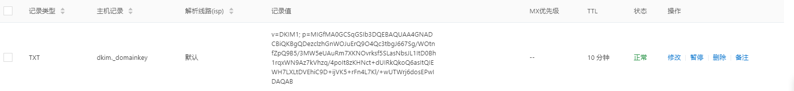

# iredmail域名证书配置

邮件服务器的安装配置有一定的复杂性，购买镜像之后，请先做好如下的准备事项：

1. 准备好一个已经备案的域名
2. 在云控制台，开启服务器->安全组8个需要用到端口：25,993,995,587,110,143,80,443
3. 向云务器厂商申请解已经安装镜像的服务器的 25 端口

我们以域名 **[websoft9.cn](http://websoft9.cn/)** 为例，对邮箱配置进行完整说明

## 解析域名，并设置主机名

1. 登录域名控制台，分别增加A、MX记录和TXT，其中TXT记录值为 *v=spf1 mx mx:mail.websoft9.cn -all*

# HTTPS/SSL证书配置

## SSL证书配置

邮件系统默认提供了证书，在配置完成之后，已经可以通过HTTPS访问。但是由于iRedMail提供的证书只是系统生成的，并没有经过认证，因此浏览器会提示不安全。

建议自行申请Symantec等证书（收费或免费均可），然后覆盖默认的证书

```
    - /etc/pki/tls/certs/iRedMail.crt
    - /etc/pki/tls/private/iRedMail.key
```

1. 将申请的证书重命名为 iRedMail.crt ，上传到 /etc/pki/tls/certs/ 目录覆盖原有系统证书
2. 将申请的证书的key重命名为 iRedMail.key， 上传到/etc/pki/tls/private/目录覆盖原有系统证书
3. 重启服务器

# 安全设置

1. 设置DKIM记录(防垃圾邮件)
   DKIM是一种防范电子邮件欺诈的验证技术，通过消息加密认证的方式对邮件发送域名进行验证。下面的步骤为邮件系统的DKIM配置步骤：

   - 查看DKIM密钥
     - 执行命令 `amavisd-new showkeys`
     - 查看 `/root/iredmail/iRedMail.tips` 文件

   > 如何 `amavisd-new` 命令不存在,请尝试使用 `amavisd`,某些Linux发行版本或者软件更新导致命令存在差异


- 在域名控制台-域名解析中再加一个TXT记录，主机记录为`dkim._domainkey` ,记录值为上图 3600 TXT 之后的“()”中的值，但要记得去掉双引号



- 测试DKIM解析：服务器上执行下面命令，若显示 pass 则说明解析成功

```
amavisd-new testkeys
```


> 经测试在配置了SPF/DKIM的情况下，QQ邮箱仍然会将您的企业邮件依然会误报为垃圾邮件,，QQ邮件设置中添加域名白名单

1. 设置常见邮箱域名白名单
   - 添加常用邮件域名白名单,服务器执行命令:
     `python /opt/iredapd/tools/spf_to_greylist_whitelists.py`
   - 添加国内常用邮箱域名白名单,服务器执行命令:
     `python /opt/iredapd/tools/spf_to_greylist_whitelists.py qq.com 163.com 126.com sina.com sina.cn aliyun.com`