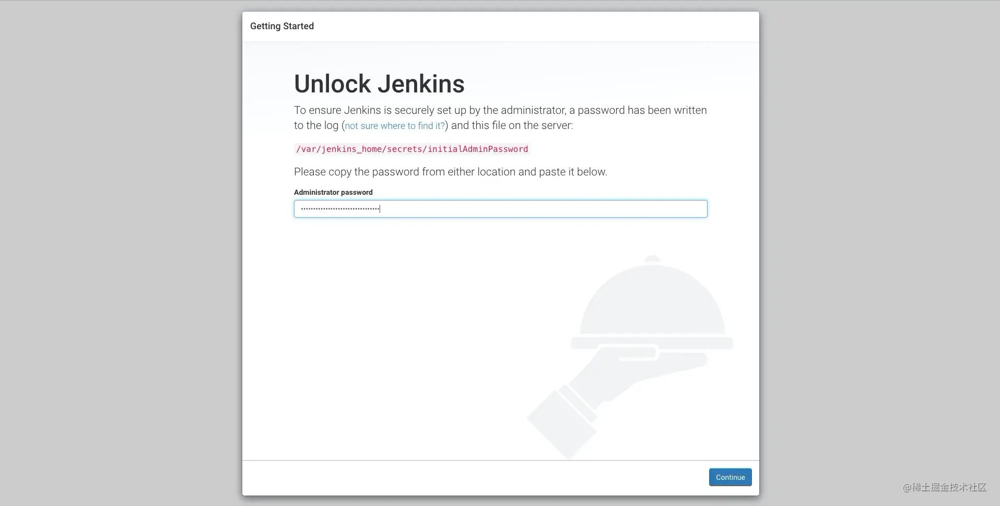
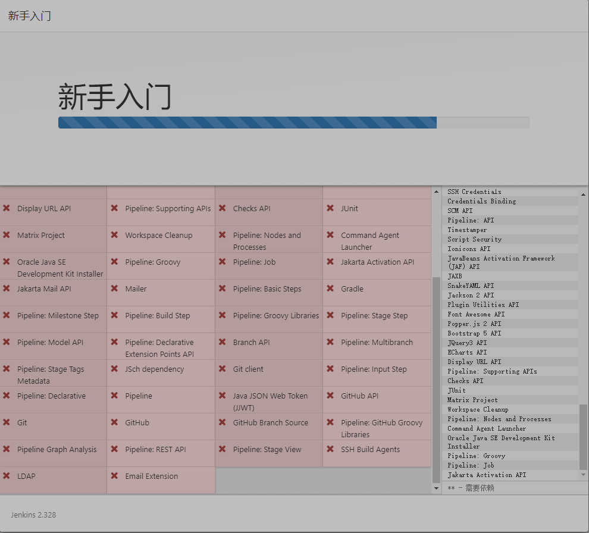
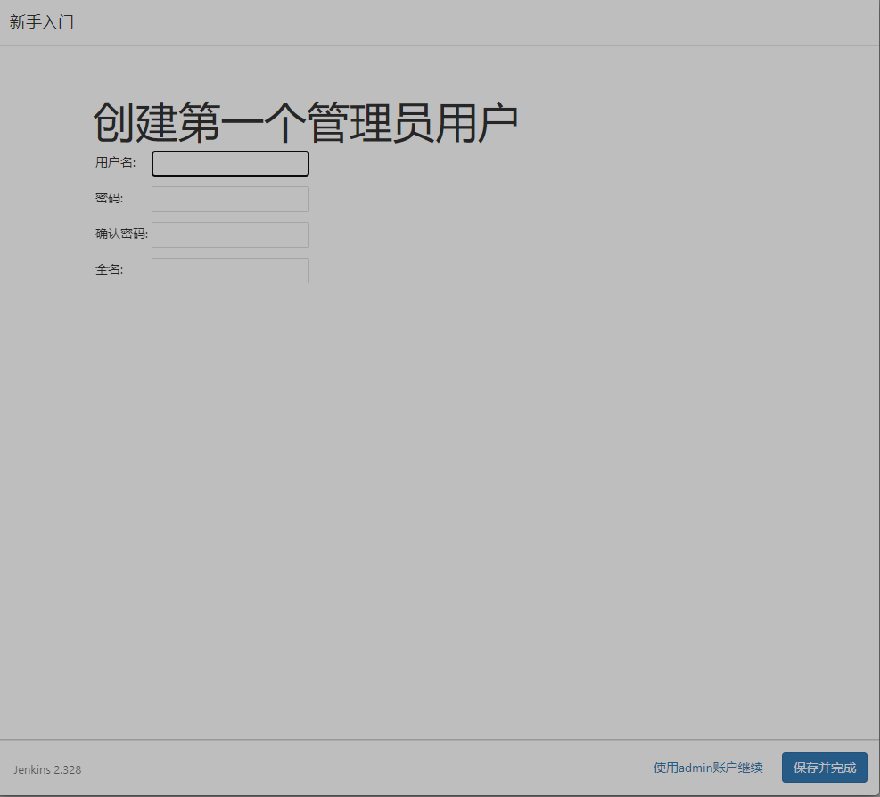
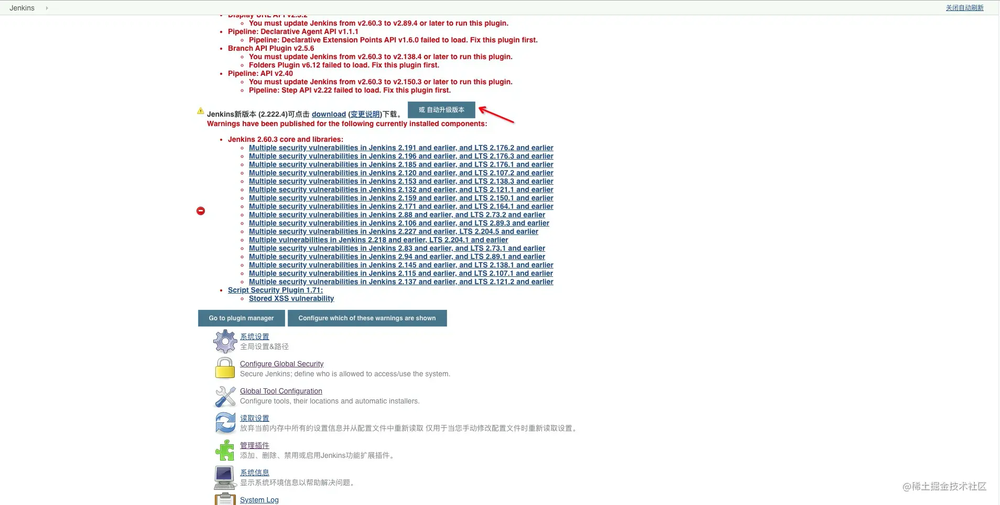
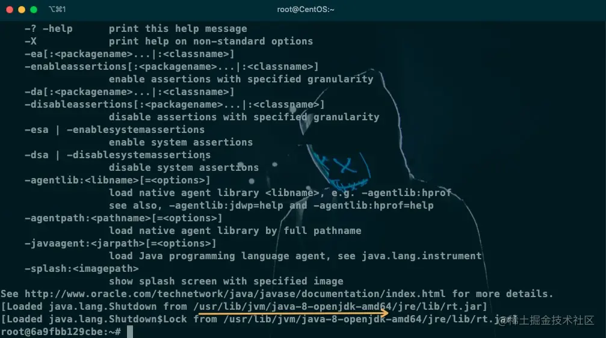

### 确认是否能安装docker

 Docker要求CentOS系统的内核版本高于3.10.通过`uname -r`命令查看你当前的内核版本。

```sh
uname -r
[root@CentOS ~]# 3.10.0-1160.83.1.el7.x86_64
```

### 安装docker 

```shell
[root@baota-1 ~]# yum install docker
```

### 启动docker

```shell
systemctl start docker
```

### 更改docker镜像源

```shell
[root@baota-1 ~]# vim /etc/docker/daemon.json 
```

### 加入阿里云源地址

```json
{"registry-mirrors":["https://6kx4zyno.mirror.aliyuncs.com"]}
```

### 重新读取配置

```shell
[root@baota-1 ~]# systemctl daemon-reload
```

### 重启docker

```shell
[root@baota-1 ~]# systemctl restart docker
```

### 安装jenkins

下载jenkins镜像

```shell
docker pull jenkins
```

#### 启动jenkins

 设置端口为9090并映射`jenkins_home`到宿主机`/home/jenkins_home`。

```shell
[root@baota-1 jenkins_home]# docker run -d --name jenkins -p 19898:8080 -v /data/jenkins_home:/var/jenkins_home jenkins
```

 可以通过`docker ps`查看运行的容器。

```
docker ps
```

#### 把玩jenkins docker镜像遇到的volume权限问题

 在运行启动jenkins的命令时，可能会出现jenkins无法启动情况。

 可以通过`docker logs 镜像名称`查看启动日志。

```
[root@baota-1 jenkins_home]# docker logs d8e206fa477f
```

 查看输出的日志，如果出现 `Permission denied` 类似的错误。需要删除旧容器重新运行。

```
[root@baota-1 jenkins_home]# docker rm jenkins 
```

 运行命令加入了`-u 0`重新运行。

```shell
[root@baota-1 jenkins_home]# docker run -d --name jenkins -p 19898:8080 -v /data/jenkins_home:/var/jenkins_home -u 0 jenkins
```

### Jenkins初始化

 启动成功后输入 http://服务器:9090/

 **如果无法访问，请检查一下防火墙端口是否开放，如果是云服务器还需要检查安全组设置**


 首次启动jenkins需要输入密码，需要进入容器内获取密码。密码位于`/var/jenkins_home/secrets/initialAdminPassword`。

进入容器

```shell
[root@baota-1 secrets]# docker exec -it jenkins /bin/bash
```

获取密码

```shell
root@fd12fe04aaf7:/var/jenkins_home# cat /var/jenkins_home/secrets/initialAdminPassword 
```

 由于我们将`/var/jenkins_home` -- 挂载到--> `/home/jenkins_home`所以也可以直接`cat /home/jenkins_home/secrets/initialAdminPassword` 获取密码。

  输入密码以后，安装需要的插件，在安装途中由于网络原因会出现有些插件安装失败，这个可以不用理会。




不论你选什么，都会出现这个


解决方案

```shell
[root@baota-1 data]# docker stop jenkins
```

```shell
[root@baota-1 data]# docker stop jenkins
```

```shell
[root@baota-1 data]# rm -rf /data/jenkins_home/
```

```shell
[root@baota-1 data]# docker pull jenkins/jenkins
```


```shell
[root@baota-1 jenkins_home]# docker run -d --name jenkins -p 19898:8080 -v /data/jenkins_home:/var/jenkins_home jenkins/jenkins
```

```shell
[root@baota-1 data]# chmod 777 /data/jenkins_home
```

```shell
[root@baota-1 data]# docker run -d --name jenkins -p 19898:8080 -v /data/jenkins_home:/var/jenkins_home jenkins/jenkins
```

```shell
[root@baota-1 data]# docker start jenkins
```


  输入密码以后，安装需要的插件，在安装途中由于网络原因会出现有些插件安装失败，这个可以不用理会。



设置jenkins的默认登录账号和密码



### 处理插件安装失败

  进入jenkins的主页面右上角可能会出现一些报错信息，主要是提示jenkins 需要的某些插件没有安装，或者说jenkins版本太低了，插件无法使用这个时候我们需要先升级jenkins做一个升级。


### 自动升级

Jenkins提供了自动升级的方式


#### 手动升级

 可以去Jenkins的官网下载好最新jar包上传到服务器，也可以使用`wget`命令。

```shell
wget http://jenkins新版本的下载地址
#目前最新2.239 
wget http://updates.jenkins-ci.org/download/war/2.239/jenkins.war
```

  Jenkins的更新主要是替换jenkins镜像里面的war包 ，我们可以把下载好的war包使用`docker cp`直接进行复制命令如下：

```shell
docker cp jenkins.war jenkins:/usr/share/jenkins
```

 重新启动Jenkins即可完成升级。

```shell
docker restart jenkins
```

### 安装必要的插件

- Localization: Chinese (Simplified) 1.0.14 汉化包 搜索关键字 chinese
- Publish Over SSH 1.20.1 搜索关键字 ssh
- DingTalk 钉钉通知 2.3.0

### 配置jenkins

#### 全局工具配置

  主要配置 jdk、maven、git等常用环境。需要注意配置的别名，后续构建将会使用到。

##### 配置jdk

  因为jenkins镜像自带jdk所以无需安装直接使用即可，进入Jenkins容器，使用`java -verbose`查看java安装路径。

```shell
docker exec -it jenkins /bin/bash
```

```
java -verbose
```




##### 配置git

 进入容器内使用`whereis git`即可查询到git安装路径。

```text
root@6a9fbb129cbe:~# whereis gitgit: /usr/bin/git /usr/share/man/man1/git.1.gzroot@6a9fbb129cbe:~#
```

