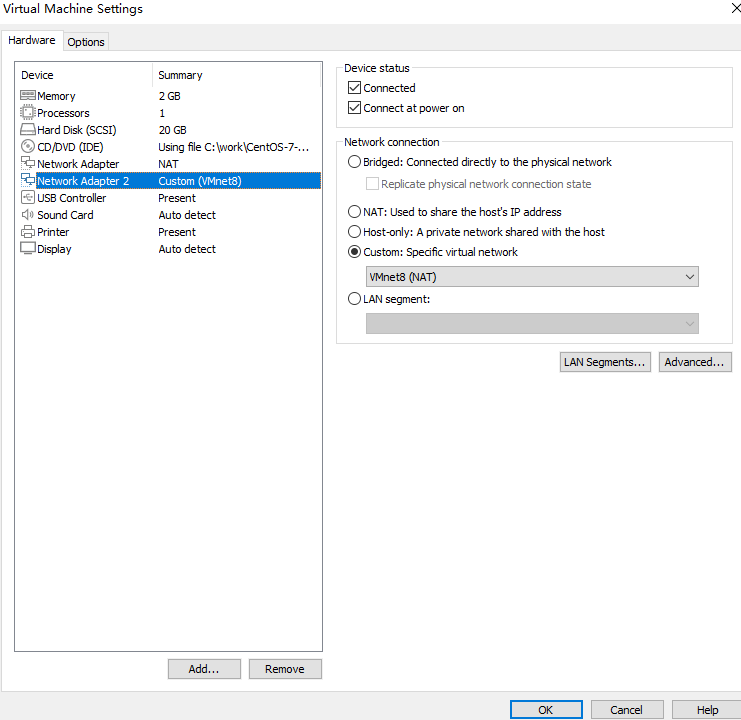
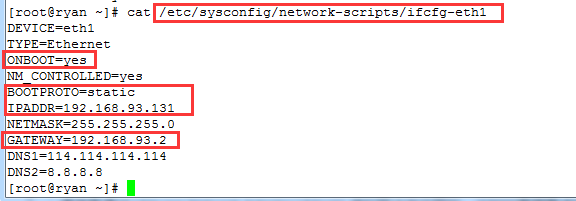

# 如何使用VMware搭建虚拟机超详细教程, 图文

有很多客户告知，在使用VM搭建虚拟机的时候，出现很多问题，如自己安装精简版本，阉割版本。如搭建好之后怎么设置都无法和局域网内其他的机器进行链接，网络不通等问题。

下面给大家带来的教程，完整的为您解决所有问题。

# **所需工具：**

**一、VMware Workstation Pro**

**二、系统镜像一枚（原装完整的iso，比如centos7）**

三、设置网络

打开 VMware --> Edit（编辑）--> VirtualNetworkEditor（虚拟网络编辑器），如图：

VMnet8：用于虚拟 NAT 网络下的虚拟交换机

四、挂载宿主机

https://www.cnblogs.com/xiaobaiskill/p/11298236.html

systemctl restart network