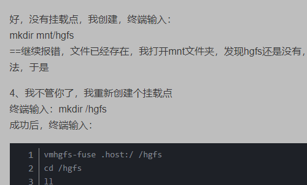

# 如何使用VMware搭建虚拟机超详细教程, 图文

有很多客户告知，在使用VM搭建虚拟机的时候，出现很多问题，如自己安装精简版本，阉割版本。如搭建好之后怎么设置都无法和局域网内其他的机器进行链接，网络不通等问题。

下面给大家带来的教程，完整的为您解决所有问题。

# **所需工具：**

**一、VMware Workstation Pro**

**二、系统镜像一枚（原装完整的iso，比如centos7）**

三、设置网络

打开 VMware --> Edit（编辑）--> VirtualNetworkEditor（虚拟网络编辑器），如图：

VMnet8：用于虚拟 NAT 网络下的虚拟交换机


四、挂载宿主机

https://www.cnblogs.com/xiaobaiskill/p/11298236.html

#### 三、安装vm-tools (请用root用户执行)

- 3.1 安装vm-tools

```kotlin
yum install -y open-vm-tools open-vm-tools-desktop
```

- 3.2 挂载

```bash
# 1 查看共享的目录
vmware-hgfsclient
# www

# 2 创建hgfs 文件夹
mkdir -p /data

# 3 用vmhgfs-fuse命令挂载目录
vmhgfs-fuse .host:/ /mnt/hgfs
vmhgfs-fuse .host:/ /newmnt/

# 4 此刻 www 目录即 真正挂载到 虚拟机上了
ls /mnt/hgfs
# www

#四、软连接至/home 目录下
# ln -s /mnt/hgfs/www /home/www
ln -s /hgfs/vmware/data /
```

### 3. 挂载共享文件夹到Centos中

上面步骤设置完，建议先重启Centos，再进行下面操作哦~，不然有时候会很坑爹的，共享配置还没更新~

默认Vmware共享的文件夹存放在 /mnt/hgfs/ 目录下，但是仅仅通过上面步骤，还是无法找到共享出去的本地目录的，还需要进行Centos的挂载；
挂载命令：

#### 四、软连接至/home 目录下

```bash
# ln -s /mnt/hgfs/www /home/www
ln -s /hgfs/vmware/data /
```

https://blog.csdn.net/weixin_43493256/article/details/89295886



systemctl restart network


systemctl restart  docker


d