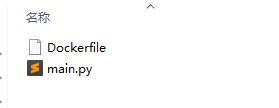
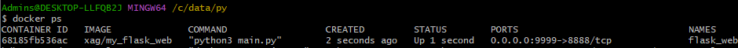
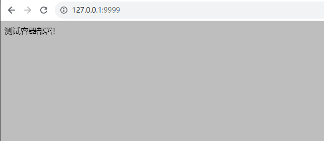

# 5 分钟，教你用 Docker 部署一个 Python 应用！

在使用传统物理机或云服务器上部署项目都会存在一些痛点

比如：项目部署速度慢、资源浪费、迁移难且扩展低

而使用 Docker 部署项目的优势包含：

- 高效利用系统资源
- 服务启动更快
- 环境一致，迁移更加方便

本篇文章将介绍 Docker 部署一个 Python 项目的常规流程

**1. Dockerfile 描述文件**
Dockerfile 是一个放置在项目根目录下的描述文件，可以利用 Docker 命令基于该文件构建一个镜像

常用的指令包含：

- FROM
  用于定义基础镜像
- MAINTAINER
  指定维护者信息，可以省略不写
- RUN
  和「 安装命令 」连接在一起，可用于安装工具依赖包
- ADD
  将宿主机的文件，并进行解压
- COPY
  和 ADD 指令功能一样，但是不会进行解压操作
- WORKDIR
  用于切换工作目录
- VOLUME
  配置宿主机与容器的目录映射
- EXPOSE
  配置容器内项目对外暴露的端口号
- CMD
  指定容器启动后，运行的命令

比如，可以运行某个命令启动项目

**2. 实战一下**
使用 Docker 部署应用的常规流程是：

- 开发项目并本地测试通过
- 编写 Dockerfile 放置到项目根目录
- 打包镜像文件
- 运行镜像容器
- 测试

为了演示方便，这里以一个简单的 Flask 项目为例进行讲解

2-1 项目开发

```python
from flask import Flask

# 安装依赖
# pip3 install -U flask

app = Flask(__name__)


@app.route('/')
def index():
    return "测试容器部署!"
w

if __name__ == '__main__':
    app.run(host='0.0.0.0', port=8888)

# 浏览器访问测试
# http://127.0.0.1:8888/
```

项目开发完成，并在本地测试通过后就可以编写 Dockerfile 文件了

2-2 编写 Dockerfile

在项目根目录下，创建一个 Dockerfile 文件，使用上面的指令编写描述脚本

需要注意的是，这里使用「 EXPOSE 」指令暴露的端口号与入口文件定义的端口号保持一致

```bash
# Dockerfile

FROM centos:7.9.2009
RUN yum makecache fast;
RUN yum install python3-devel python3-pip -y
RUN pip3 install -i https://pypi.douban.com/simple flask
COPY main.py /opt
WORKDIR /opt
EXPOSE 8888
CMD ["python3","main.py"]
```



2-3 构建镜像

```shell
# 在当前文件夹下，根据Dockerfile文件构建一个镜像
# 镜像名称：xag/my_flask_web
# --no-cache：不使用旧的缓存进行镜像构建
docker build --no-cache -t "xag/my_flask_web" .
```

2-4 运行镜像容器

使用 docker run 命令基于镜像运行一个容器

其中

```markdown
* -d：代表容器在后台运行，不是基于前台运行
* --name：用于执行容器的别名
* -p：用于配置宿主机与容器的端口映射

# -d：后台运行
# 宿主机（9999）映射容器内的8888（上面Dockerfile已经暴露了8888端口）
docker run -d --name flask_web -p 9999:8888 xag/my_flask_web  
```



2-5 测试一下

最后在浏览器中，通过宿主机暴露的端口号 9999 访问项目了

访问地址：http://127.0.0.1:9999/



**3. 总结**
文章中以一个简单的 Web 项目阐述了利用 Docker 部署项目的常规流程

实际上，Dockerfile 非常的灵活，它还支持 ARG/ENV 设置环境变量，VOlUME 指令挂载目录，ENTRYPOINT 配置启动程序和参数等，这部分内容大家可以根据官网介绍自行进行扩展