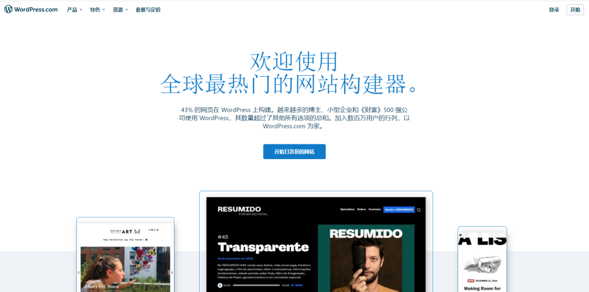
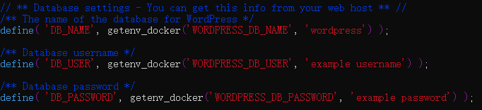
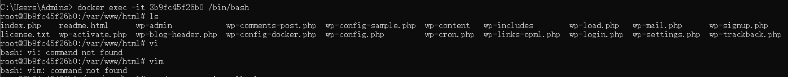
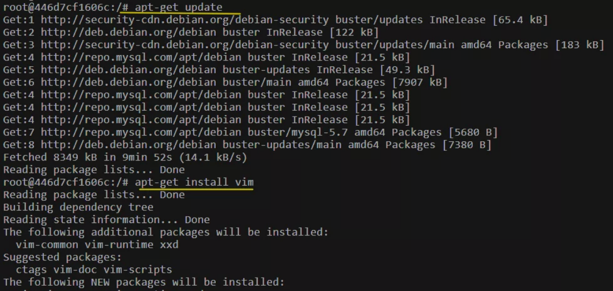
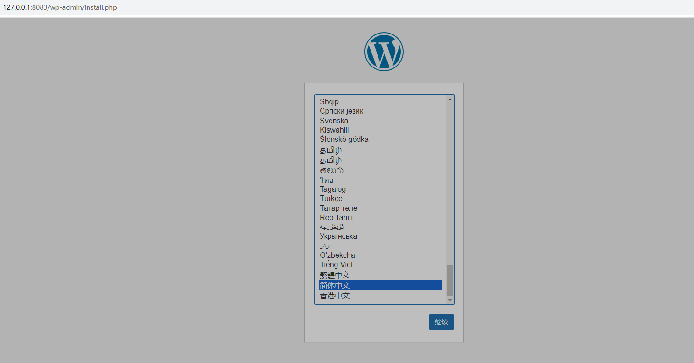
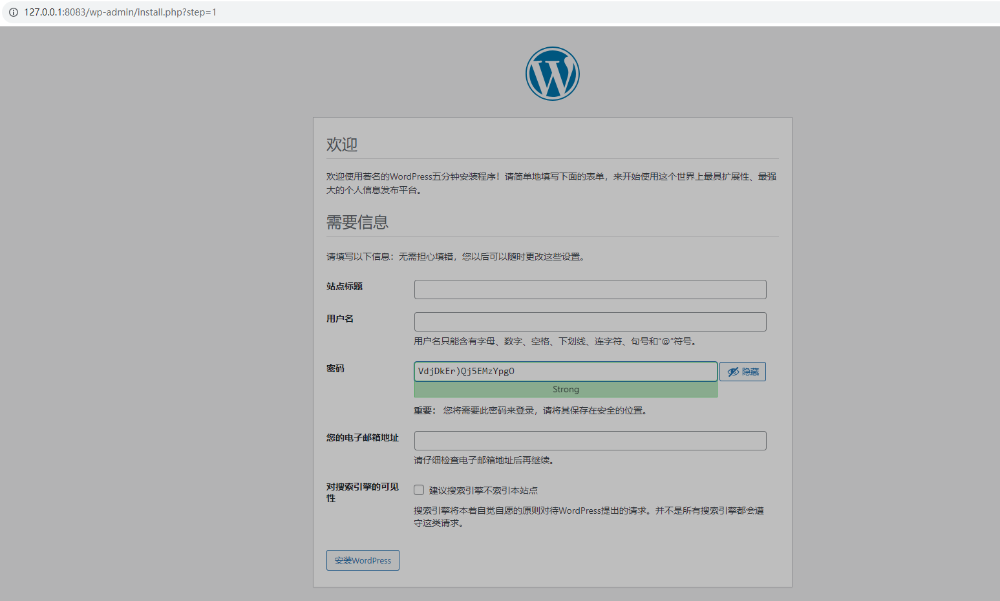
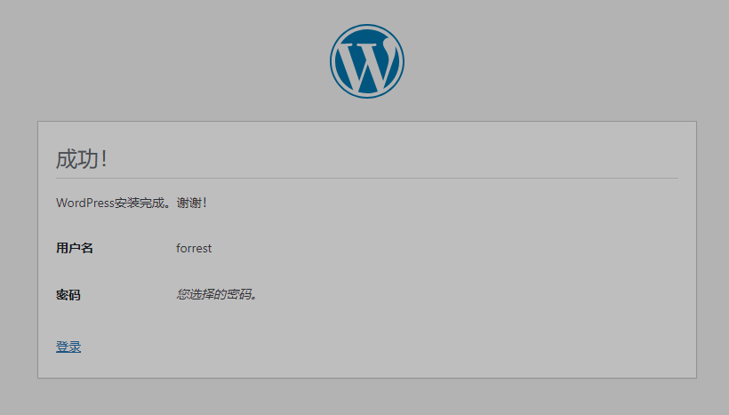
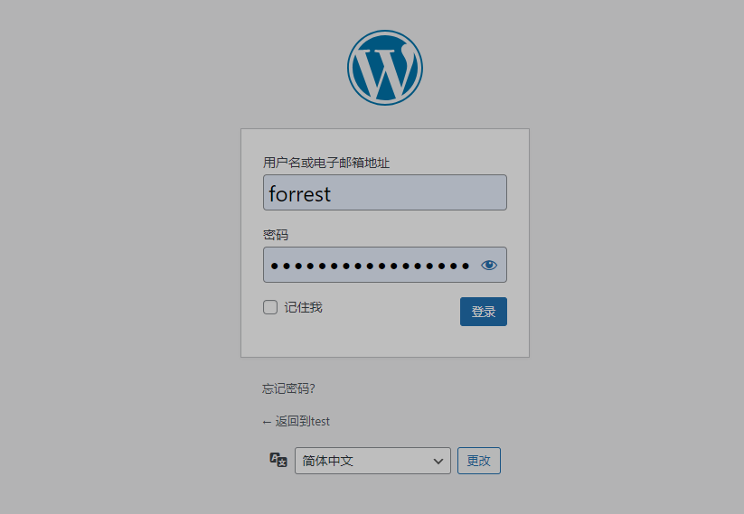
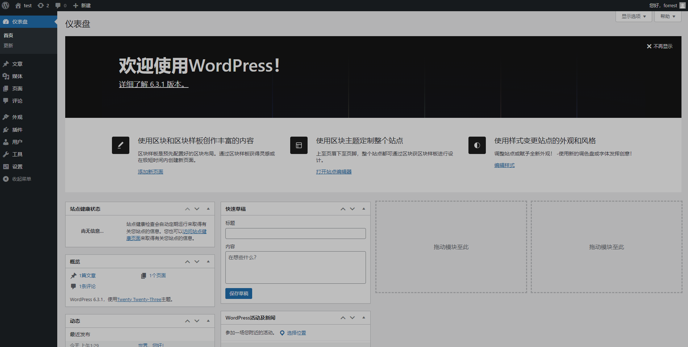

# 利用docker部署一个wordpress

# Docker实战：Docker安装WordPress，快速搭建自己的博客

作者：郝光明2022-10-09 07:21:21

[开发](https://www.51cto.com/developer)[架构](https://www.51cto.com/architecture)

很多关于安装wordpress的文章会考虑直接在安装wordpress的同时配置mysql，很容易出现各种各样的问题，这里就不列举了。推荐采用我的这种方式。浏览器首次访问wordpress的同时进行配置mysql数据库。

### 1、WordPress介绍

官网：https://wordpress.com/zh-cn/



WordPress是一种基于php编程语言开发的CMS管理系统，WordPress有丰富的插件和模板，用户可以快速搭建一套功能十分强大的内容管理系统，使用WordPress可以做多种类型的网站，比如新闻发布网站、企业门户、个人技术博客等。

今天给大家分享一下通过docker快速部署一套WordPress系统，感兴趣的朋友可以一起来学习一下！

### 2、Dcoker快速部署WordPress

一，通过 docker pull 命令在官方网站上把需要的 docker 镜像拉取下来

```shell
docker pull wordpress

docker pull mysql
```

官网地址：[hub.docker.com](https://hub.docker.com/)
二，创建 mysql 容器

```php
docker run -d --name mysql -v mysql-data:/var/lib/mysql -e MYSQL_ROOT_PASSWORD=root -e MYSQL_DATABASE=wordpress mysql
```

 参数解析 

`-d`                    后台运行容器，并返回容器id

`--name`                自定义容器名

`-v`                    将容器内的目录挂载到[宿主机](https://cloud.tencent.com/product/cdh?from_column=20065&from=20065)中(前是宿主机路径/后是容器路径)

`-e`                    用来指定环境变量以及后续的键值对

`MYSQL_ROOT_PASSWORD`   [数据库](https://cloud.tencent.com/solution/database?from_column=20065&from=20065)密码

`MYSQL_DATABASE`        数据库表名

`mysql`             镜像仓库中的镜像标签版本

三，创建 wordpress 容器

```shell
docker run -d -e WORDPRESS_DB_HOST=mysql:3306 --link mysql -p 8083:80 wordpress
```

 参数解析 

`-d`                    后台运行容器，并返回容器id

`--name`                自定义容器名

`-e`                    用来指定环境变量以及后续的键值对

`WORDPRESS_DB_HOST`     数据库链接

`--link`                关联到另一台容器，后面加容器名

`-p`                    指定端口映射(前是宿主机/后是容器端口)

`wordpress`             wordpress镜像

### 4.访问地址

```text
用户地址：https://服务器ip:8083

管理地址：https://服务器ip:8083/wp-admin/
```

复制

### 5.异常问题解决

url访问后，页面出现以下问题

```bash
Error establishing a database connection
```

复制

 解决办法 

1.进入容器 docker exec -it 容器id /bin/bash

2.编辑配置文件 vim wp-config.php

3.修改数据库账号和密码 **修改下图红框中的内容为你的数据库账号和密码,注意不要去掉引号** 



我们在创建基础容器之后，进入容器，进行编辑配置文件的时候，需要使用vim或者vi命令，但是会出现：



这是因为vim没有安装。
解决方案
使用如下命令安装：

```shell
apt-get update
apt-get install vim
```



四，浏览器访问地址：[49.233.216.163:8083/](http://49.233.216.163:8083/)

输入你的公网ip+1080 测试是否可以正常访问。效果如下图：

示例：127.0.0.1:1080；

出现如下界面，证明安装成功

选择安装语言为简体中文；



输入网站信息，比如网站标题、登录用户名、密码等。



然后安装就成功了。



登录系统；



登录后的管理主界面；

