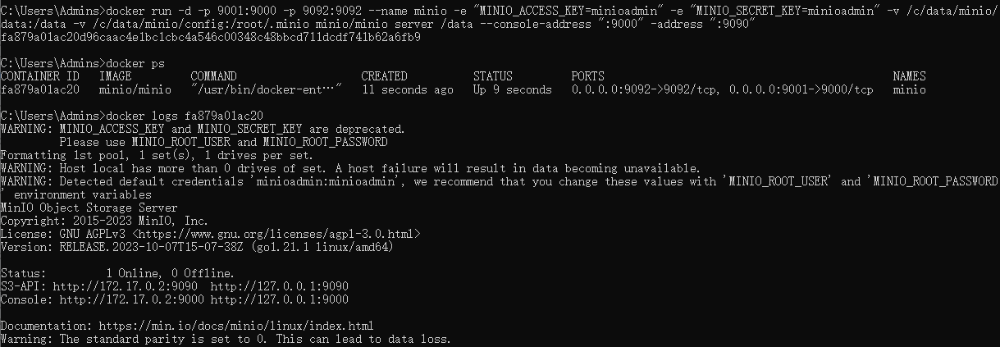

# 记录Minio Docker部署


#### 前言

Minio是一个对象存储服务器，就是一个oss。做文件存储，下载等功能。本文主要是讲如何通过docker的方式搭建自己的对象存储服务器。

#### 搜索minio镜像

1.使用我们的docker search 命令进行搜索镜像

如下图所示。


2.去到我们的docker hub 官网搜索我们需要的minio镜像

hub.docker.com

搜索框搜索minio/minio镜像

点进去以后，tags卡片下就可以找到你所需要的版本对应的镜像，旁边就是复制对应的docker命令了。


#### 拉取minio镜像

使用docker pull minio/minio命令拉取我们需要的镜像，默认是latest最新版本的镜像。如你需要指定版本的镜像如：docker pull minio/minio:RELEASE.2023-02-27T18-10-45Z.fips拉取指定的镜像。


#### 提前创建两个docker容器挂载目录

```shell
mkdir -p /c/data/minio/config

mkdir -p /c/data/minio/config
```


一个用来存放配置，一个用来存储上传文件的目录

启动前需要先创建Minio外部挂载的配置文件（ /home/minio/config）,和存储上传文件的目录（ /home/minio/data）

#### 创建minio容器并运行

```shell
docker run -d -p 9001:9000 -p 9092:9092 --name minio -e "MINIO_ACCESS_KEY=minioadmin" -e "MINIO_SECRET_KEY=minioadmin" -v /c/data/minio/data:/data -v /c/data/minio/config:/root/.minio minio/minio server /data --console-address ":9000" -address ":9090"
```

解读：

1. -p 9001:9000 端口映射 9001映射9000
2. --name minio 名称
3. -e "MINIO_ACCESS_KEY=minioadmin" minio账号
4. -e "MINIO_SECRET_KEY=minioadmin" minio密码
5. -v /home/minio/data:/data 存储文件目录映射
6. -v /home/minio/config:/root/.minio 配置文件目录映射
7. minio/minio server /data --console-address ":9000" -address ":9092" minio启动命令，需要注意的是：老版本minio不需要--console-address":9000 -address ":9090" 这是新版本需要启动命令时加上。其意思是指定控制台端口,以及API端口，可以任意指定。

下图是minio启动成功后的容器日志。



#### 访问ip+9001(刚才映射的端口号)

输入部署时设置的minio_access_key（用户名）minio_secret_key（密码）


#### 创建一个bucket

如图所示创建一个bucket

解读一下：

1. bucket name：bucket名字。
2. versioning: 版本控制允许在同一个键下保留同一个对象的多个版本。
3. object locking：对象锁定防止对象被删除。需要支持保留和合法持有。只能在创建桶时启用。
4. quota：配额用于限制桶内的数据量。
5. retention：保留是指在一段时间内防止对象删除的规则。为了设置桶保留策略，必须启用版本控制。


#### 测试文件上传

如下图所示：点击object browser选择你要上传的bucket然后点击upload。


选择上传文件还是上传文件夹


至此我们就上传了第一文件了。


#### 后记

此文主要是记录通过docker搭建minio。后续会陆陆续续编写对应的详细讲解如如何永久的访问文件，如何通过springboot集成minio，作为项目中的对象存储。