> 没有夸大标题哈，能够成功的，实测后发文 本文主要讲怎么用Docker部署[Mysql](https://cloud.tencent.com/product/cdb?from_column=20065&from=20065)的主从复制，看起来很长，实际非常简单的，看一遍，立马就能懂的。 直接CV也能搭建起来，莫慌。 `我们一起加油！！！` 


 地点：`泰山日出`

## 一、拉取镜像

```javascript
docker pull mysql:5.7
```

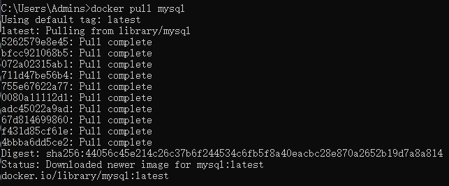

相关命令：

- 查看镜像：`docker images`

## 二、启动镜像

先启动mysql01容器：（即之后的主机）

```shell
docker run -d -p 3310:3306 -v /home/mysql/node-1/config:/etc/mysql/ -v /home/mysql/node-1/data:/var/lib/mysql  -e MYSQL_ROOT_PASSWORD=123456  --name mysql01 mysql:5.7
```

复制

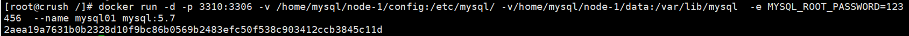

在这里插入图片描述

再启动mysql02容器：（即之后的从机）

```javascript
docker run -d -p 3311:3306 -v /home/mysql/node-2/config:/etc/mysql/ -v/home/mysql/node-2/data:/var/lib/mysql  -e MYSQL_ROOT_PASSWORD=123456 --name mysql02 mysql:5.7
```

复制

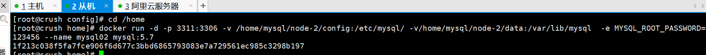

在这里插入图片描述

命令解释：

- -d： 后台运行容器，并返回容器ID
- -p 3311:3306 ：将容器的3306端口映射到[宿主机](https://cloud.tencent.com/product/cdh?from_column=20065&from=20065)3310端口
- -e MYSQL_ROOT_PASSWORD=123456 ：配置数据库连接密码
- -v /home/mysql/node-2/config:/etc/mysql/ ：将配置文件夹挂载到宿主机
- –name mysql01（02）：将容器命名为 mysql01（02）

相关命令：

```javascript
docker ps -a #查看全部容器（运行中加未运行的）
```

复制

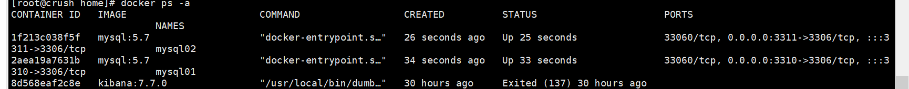

在这里插入图片描述

都已正常启动。

## 三、连接测试

搭建过程中，为了减少错误的产生，就多了这一步的测试。

我们可以直接拿`Navicat`来进行连接测试。

`注意事项`： 记得打开安全组，虚拟机的话记得处理好防火墙。（另外我这里是3310，可根据自己需要更改端口）

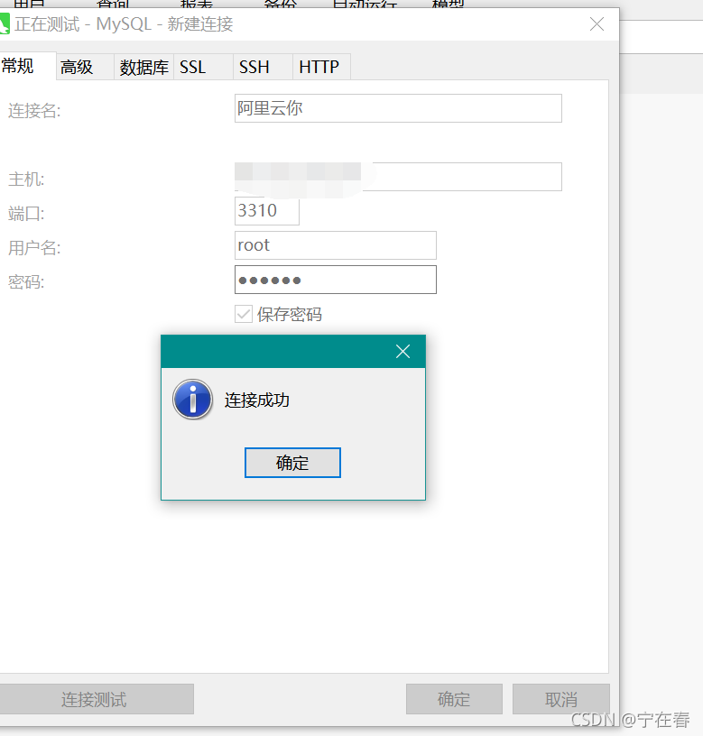

在这里插入图片描述

测试启动成功后，我们再来进行下一步。

------

## 四、编写主从复制配置文件

之前我们启动的时候写了这句`-v /home/mysql/node-1/config:/etc/mysql/`，将mysql 的配置文件夹和宿主机的文件夹挂载起来的。

那么我们就可以直接在宿主机下的`/home/mysql/node-1/config/`编写配置文件了。

### 4.1、编写主机配置文件

我们先编写主机上的配置文件：

```javascript
vim my.cnf
```

复制

回车之后是这样的：

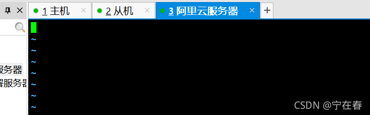

在这里插入图片描述

先按`insert`键，然后直接将下面主机的配置文件复制上去即可：

```javascript
[mysqld]
#修改配置文件：vim /etc/my.cnf
#主服务器唯一ID
server-id=1
#启用二进制日志
log-bin=mysql-bin
# 设置不要复制的数据库(可设置多个)
binlog-ignore-db=mysql
binlog-ignore-db=information_schema
#设置需要复制的数据库 需要复制的主数据库名字
binlog-do-db=testdb
#设置logbin格式
binlog_format=STATEMENT
```

复制

**退出方式**：

先按`Esc`键–>再按`Shift+:`键–>输入wq–保存退出。

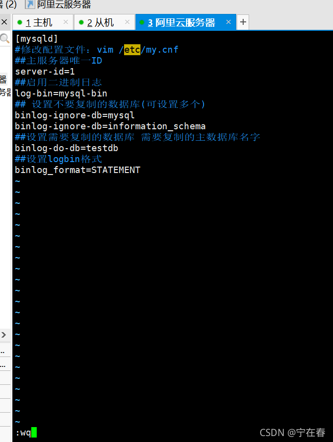

在这里插入图片描述

### 4.2、编写从机配置文件

从机上的my.cnf也是同样的方式

```javascript
[mysqld]
#从服务器唯一ID
server-id=2
#启用中继日志
relay-log=mysql-relay
```

复制

**重新启动mysql容器**

```javascript
docker restart mysql01  mysql02	
```

复制

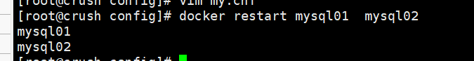

在这里插入图片描述

```javascript
docker ps -a #查看容器
```

复制

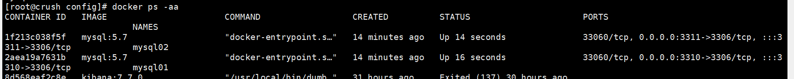

在这里插入图片描述

接下来就是搭建主从复制了。

## 五、搭建主从复制

### 5.1、主机设置

```javascript
docker exec -it mysql01 /bin/bash #进入容器
mysql -uroot -p123456 #连接mysql
```

复制

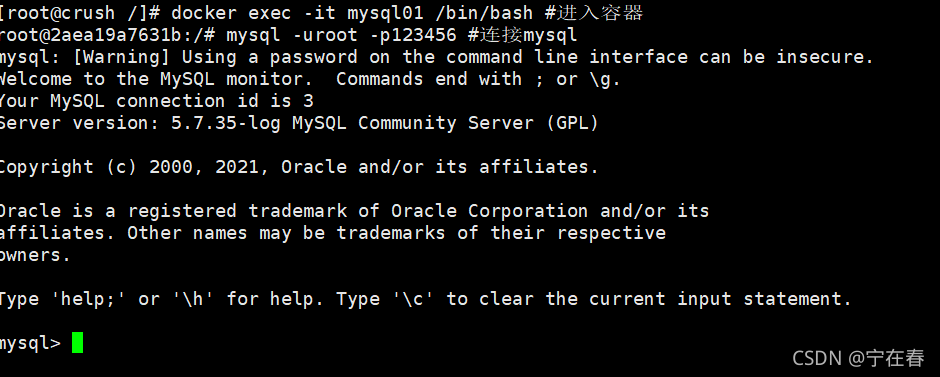

在这里插入图片描述

### 5.2、主机上建立帐户并授权 slave

给从机授权，为了让从机能够和主机连接起来。

```javascript
GRANT REPLICATION SLAVE ON *.* TO 'slave'@'%' IDENTIFIED BY '123456';
```

复制

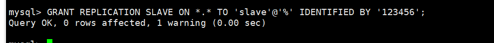

在这里插入图片描述

### 5.3、查询master状态

```javascript
show master status; #查询master的状态
```

复制

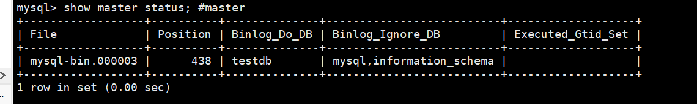

在这里插入图片描述

把这里的`File和Position`记下来哈，等下在从机上要用到。

```javascript
File: mysql-bin.000003
Position: 438
```

复制

`Binlog_Do_DB`：需要复制的数据库。

`Binlog_Ignore_DB`：不需要复制的数据库。

注意：此步骤后不要再操作主服务器MySQL，防止主服务器状态值变化

### 5.4、从机设置

进入`mysql02`容器

```javascript
docker exec -it mysql02 /bin/bash
mysql -uroot -p123456
```

复制

**复制主机的命令**

```javascript
CHANGE MASTER TO MASTER_HOST='主机的ip地址',
MASTER_USER='slave',
MASTER_PASSWORD='123456',
MASTER_PORT=3310, 
MASTER_LOG_FILE='mysql-bin.000003',MASTER_LOG_POS=438;
#解释：
# 	CHANGE MASTER TO MASTER_HOST='主机的IP地址',
#	MASTER_USER='slave'(刚刚配置的用户名),
#	MASTER_PASSWORD='123456'(刚刚授权的密码),
#	master_port=主机开放的端口 我这里是3310端口,
#	MASTER_LOG_FILE='mysql-bin.具体数字',MASTER_LOG_POS=具体值(之前的Position);
```

复制

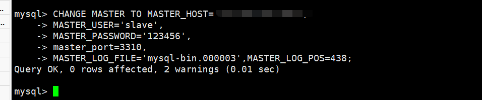

在这里插入图片描述

`注意事项`：如果在这里出现错误，先重置。执行完下面两条命令。

```javascript
stop slave;
reset master;
```

复制

**启动从服务器复制功能**

```javascript
start slave;
```

复制


在这里插入图片描述

**查看从服务器状态**

```javascript
show slave status\G
```

复制

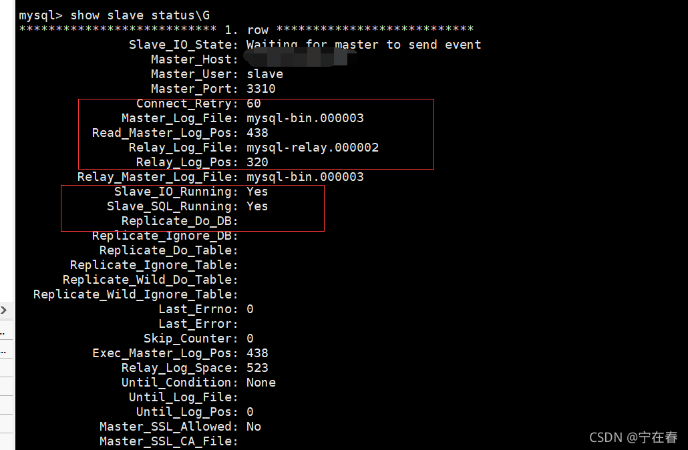

在这里插入图片描述

\#下面两个参数都是Yes，则说明主从配置成功！

```javascript
Slave_IO_Running: Yes 
Slave_SQL_Running: Yes
```

复制

## 六、测试主从复制

### 6.1、主机新建库 -从机复制

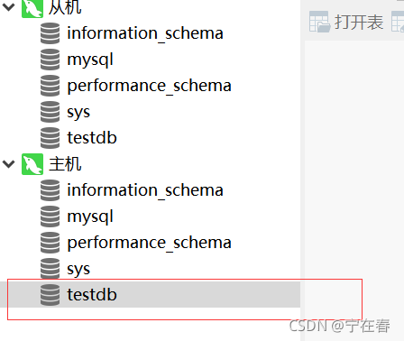

在这里插入图片描述

在主机新建`testdb`后，从机也随之就有了。（这里的命名是确定的，因为在配置文件中说明了复制`testdb`数据库）。

### 6.1、新建表-从机复制

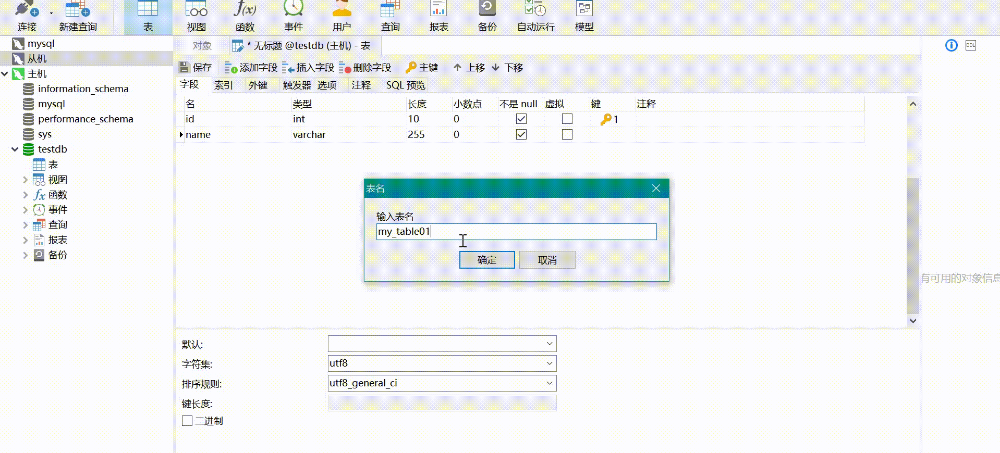

在这里插入图片描述

### 6.3、insert 记录-从机复制

### 6.3、insert 记录-从机复制

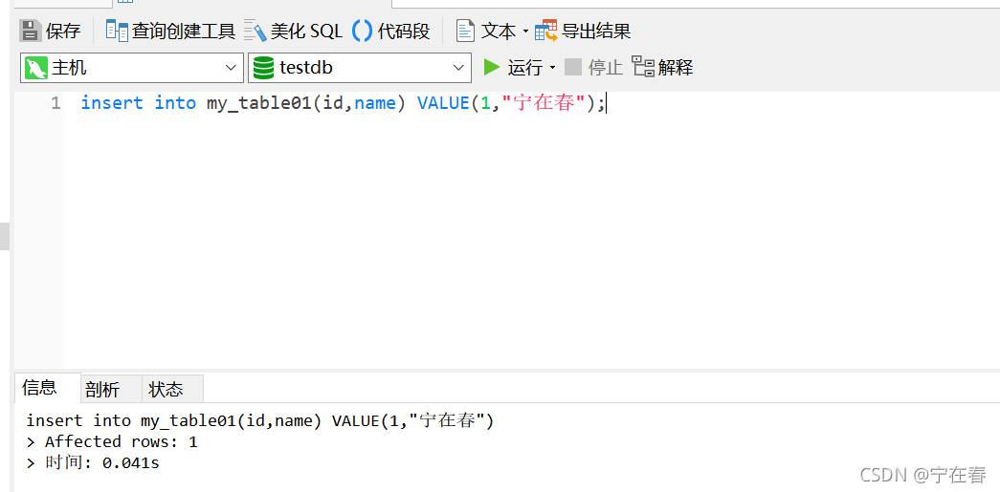

在这里插入图片描述

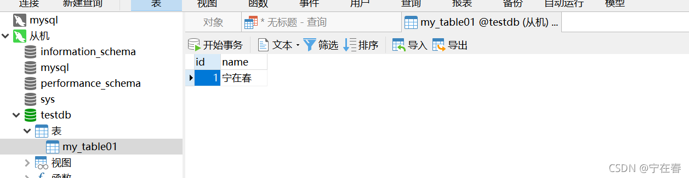

在这里插入图片描述

当然这些还是有看不出到底有没有复制的话，咱们直接测试函数，就能知道啦。

```javascript
insert into my_table01(id,name) VALUE(1,@@hostname);
```

复制


在这里插入图片描述

这就可以看出主从复制确实是成功的，但是在使用函数上有数据不一致的问题。

## 七、重置配置主从

如何停止从服务复制功能

```javascript
stop slave; 
```

复制

如何重新配置主从 （即清除之前的主从配置）

```javascript
stop slave;
reset master;
```

复制

## 八、自言自语

下一篇打算讲一下`mysql`的[中间件](https://cloud.tencent.com/product/tdmq?from_column=20065&from=20065)`mycat`实现读写分离，或者说点理论😀，咱们一步一步来哈😁。

最近在持续更新中，如果你觉得文章对你有所帮助，也感兴趣的话，关注我吧。

**我们：待别时相见时，都已有所成**。